# Diagrammes d'Architecture - 5 Projets d'Authentification

Documentation visuelle des architectures avec diagrammes Mermaid.

---

## Table des matières

1. [Vue d'ensemble comparative](#vue-densemble-comparative)
2. [Demo-0 : Clerk Webhook](#demo-0--clerk-webhook)
3. [Demo-1 : Clerk Upsert Basic](#demo-1--clerk-upsert-basic)
4. [Demo-2 : Clerk Upsert Relations](#demo-2--clerk-upsert-relations)
5. [Demo-3 : NextAuth Basic](#demo-3--nextauth-basic)
6. [Demo-4 : NextAuth Relations](#demo-4--nextauth-relations)
7. [Comparaisons](#comparaisons)
8. [Flux de migration](#flux-de-migration)

---

## Vue d'ensemble comparative

### Architecture générale des 5 projets

```mermaid
graph TB
    subgraph "Demo-0: Clerk Webhook"
        A0[Utilisateur] --> B0[Clerk Auth]
        B0 --> C0[Webhook Event]
        C0 --> D0[API Route]
        D0 --> E0[Prisma]
        E0 --> F0[(Supabase)]
    end
    
    subgraph "Demo-1: Clerk Upsert"
        A1[Utilisateur] --> B1[Clerk Auth]
        A1 --> C1[Page Load]
        C1 --> D1[syncUser]
        D1 --> E1[Prisma Upsert]
        E1 --> F1[(Supabase)]
    end
    
    subgraph "Demo-2: Clerk Relations"
        A2[Utilisateur] --> B2[Clerk Auth]
        A2 --> C2[Page Load]
        C2 --> D2[syncUser + Relations]
        D2 --> E2[Prisma]
        E2 --> F2[(Supabase)]
    end
    
    subgraph "Demo-3: NextAuth Basic"
        A3[Utilisateur] --> B3[NextAuth]
        B3 --> C3[PrismaAdapter]
        C3 --> D3[Auto Sync]
        D3 --> E3[(Supabase)]
    end
    
    subgraph "Demo-4: NextAuth Relations"
        A4[Utilisateur] --> B4[NextAuth]
        B4 --> C4[PrismaAdapter]
        C4 --> D4[Auto Sync + Relations]
        D4 --> E4[(Supabase)]
    end
```

### Matrice de décision

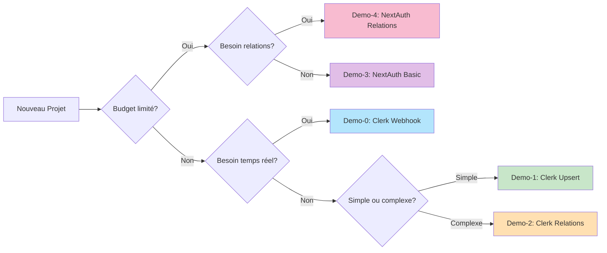

---

## Demo-0 : Clerk Webhook

### Architecture complète

```mermaid
graph TB
    subgraph "Client"
        USER[Utilisateur]
        APP[Application Next.js]
    end
    
    subgraph "Clerk Service"
        CLERK[Clerk Auth]
        WEBHOOK_SENDER[Webhook Sender]
    end
    
    subgraph "Application Server"
        ROUTE[/api/webhooks/clerk]
        SVIX[Svix Verification]
        HANDLER[Event Handler]
        PRISMA[Prisma Client]
    end
    
    subgraph "Database"
        DB[(Supabase PostgreSQL)]
    end
    
    USER -->|Login/Signup| CLERK
    CLERK -->|Auth Success| APP
    CLERK -->|Event: user.created| WEBHOOK_SENDER
    CLERK -->|Event: user.updated| WEBHOOK_SENDER
    CLERK -->|Event: user.deleted| WEBHOOK_SENDER
    
    WEBHOOK_SENDER -->|POST with signature| ROUTE
    ROUTE --> SVIX
    SVIX -->|Verified| HANDLER
    SVIX -->|Invalid| REJECT[Return 400]
    
    HANDLER -->|user.created| CREATE[Prisma.create]
    HANDLER -->|user.updated| UPDATE[Prisma.update]
    HANDLER -->|user.deleted| DELETE[Prisma.delete]
    
    CREATE --> PRISMA
    UPDATE --> PRISMA
    DELETE --> PRISMA
    PRISMA --> DB
    
    APP -->|Read User| PRISMA
```

### Flux de synchronisation webhook

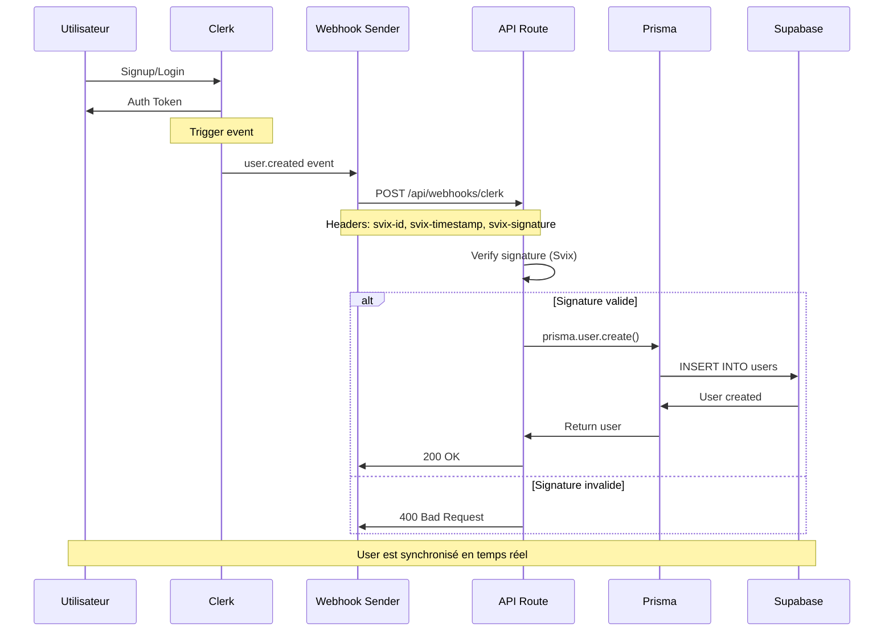

### Schéma de base de données

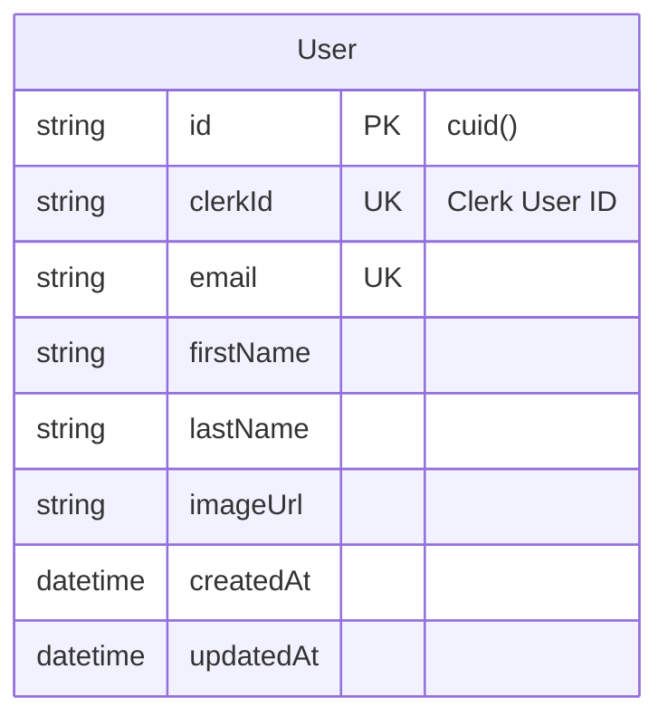

---

## Demo-1 : Clerk Upsert Basic

### Architecture complète

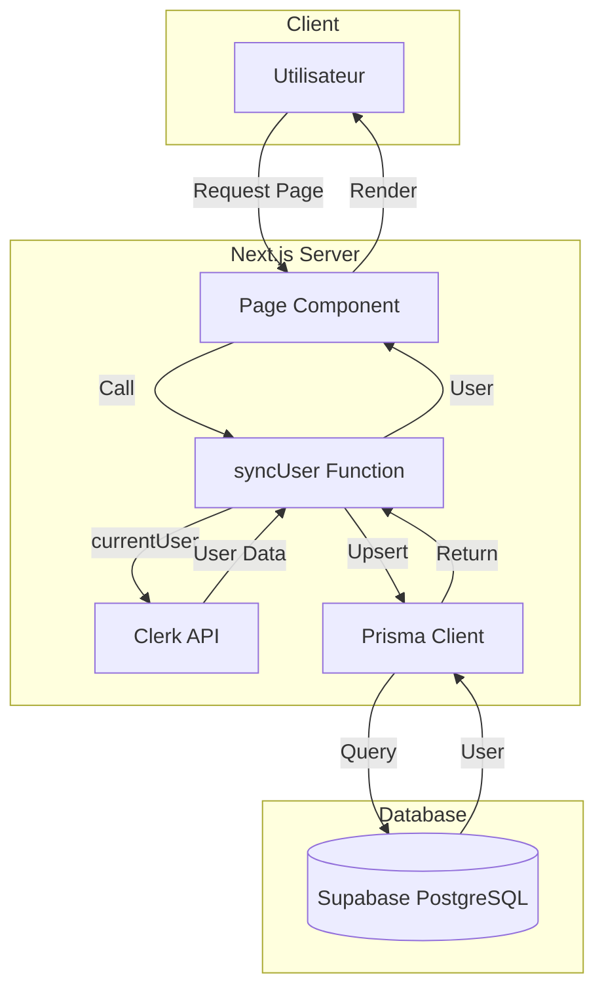

### Flux de synchronisation upsert

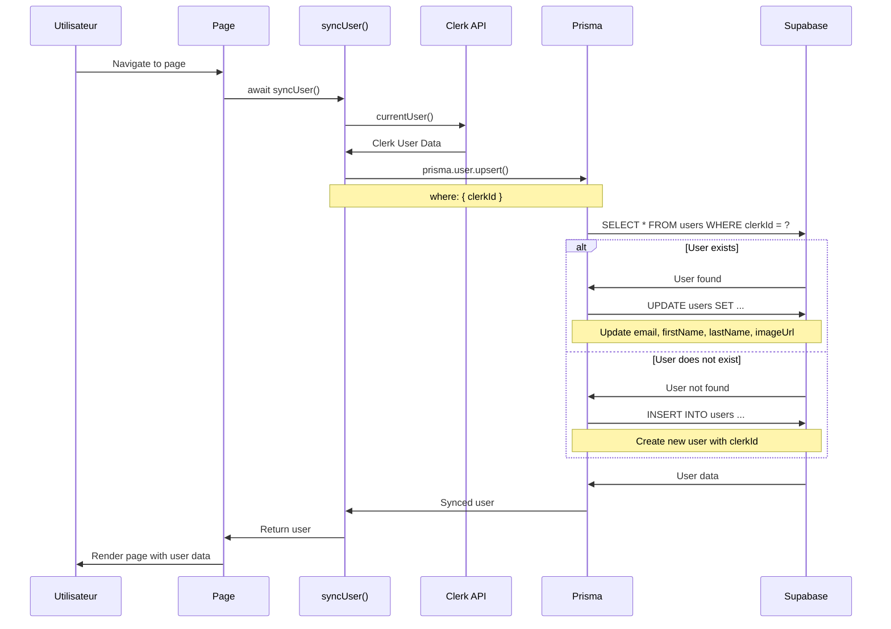

### Schéma de base de données


### Flux de chargement page

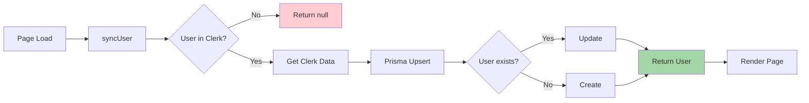

---

## Demo-2 : Clerk Upsert Relations

### Architecture complète

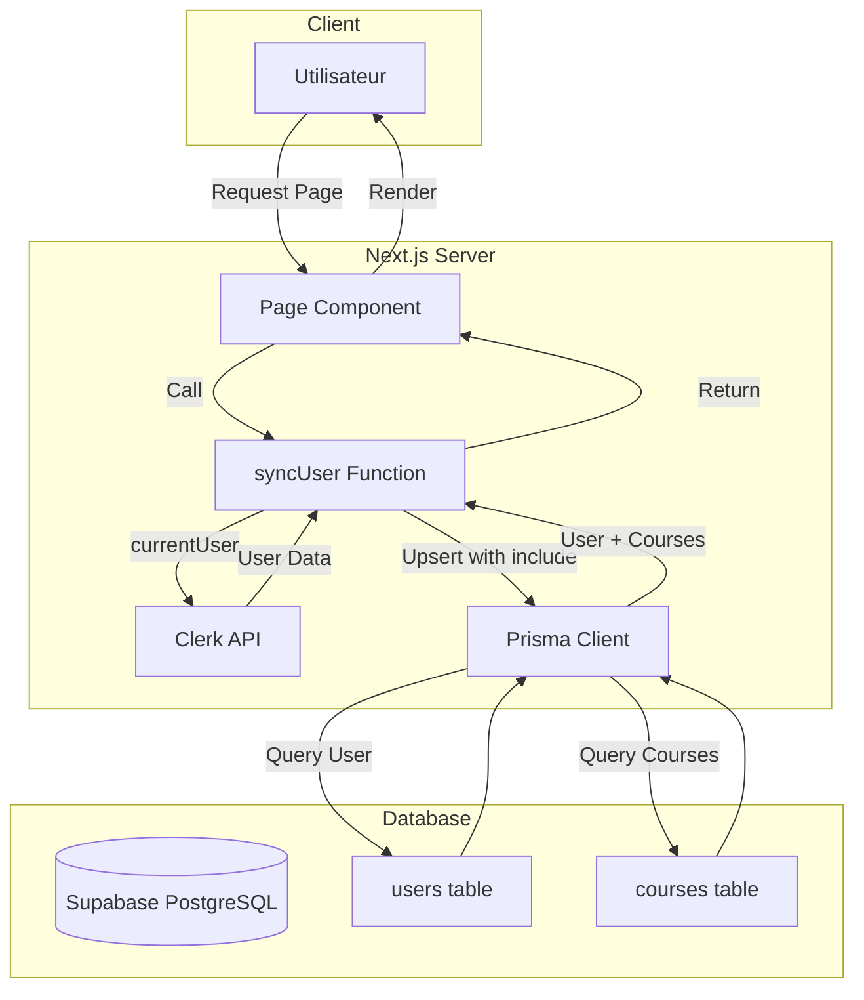

### Flux avec relations

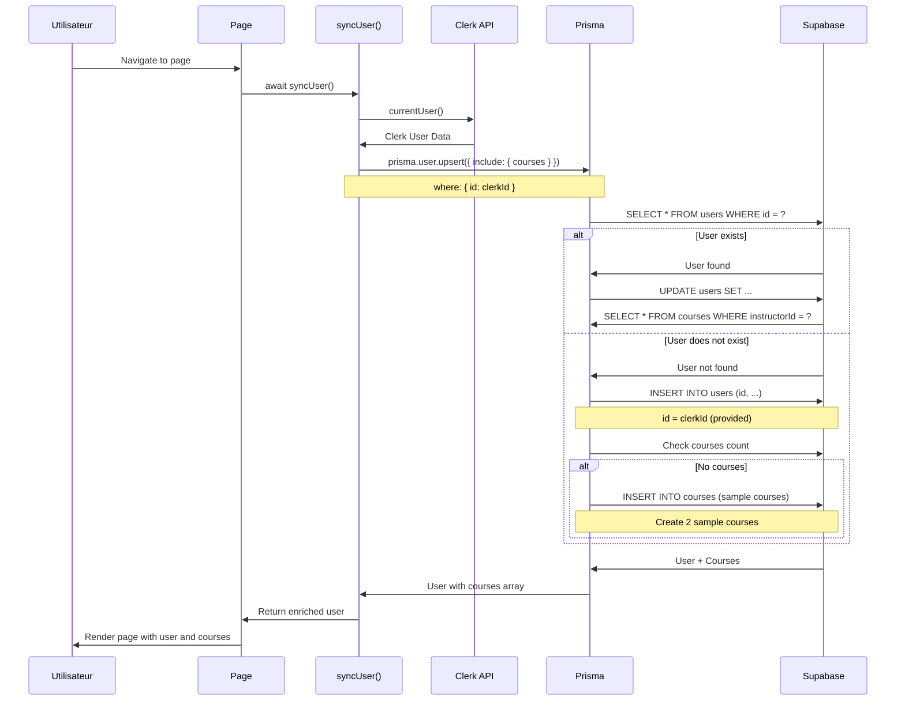

### Schéma de base de données

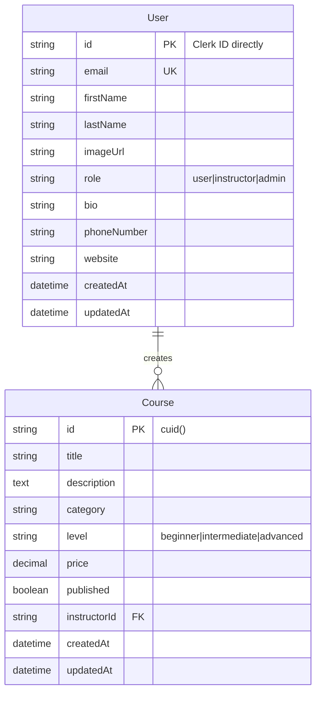

### Différence clé : ID Schema

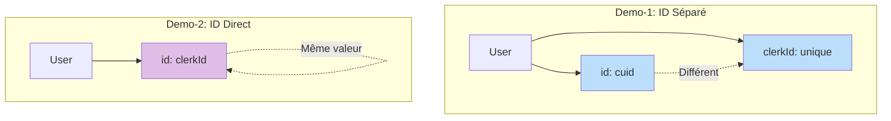

---

## Demo-3 : NextAuth Basic

### Architecture complète

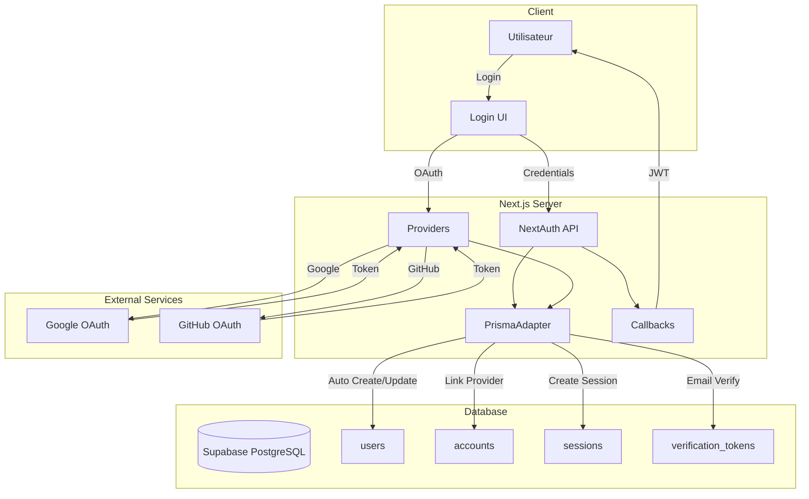

### Flux d'authentification Google OAuth

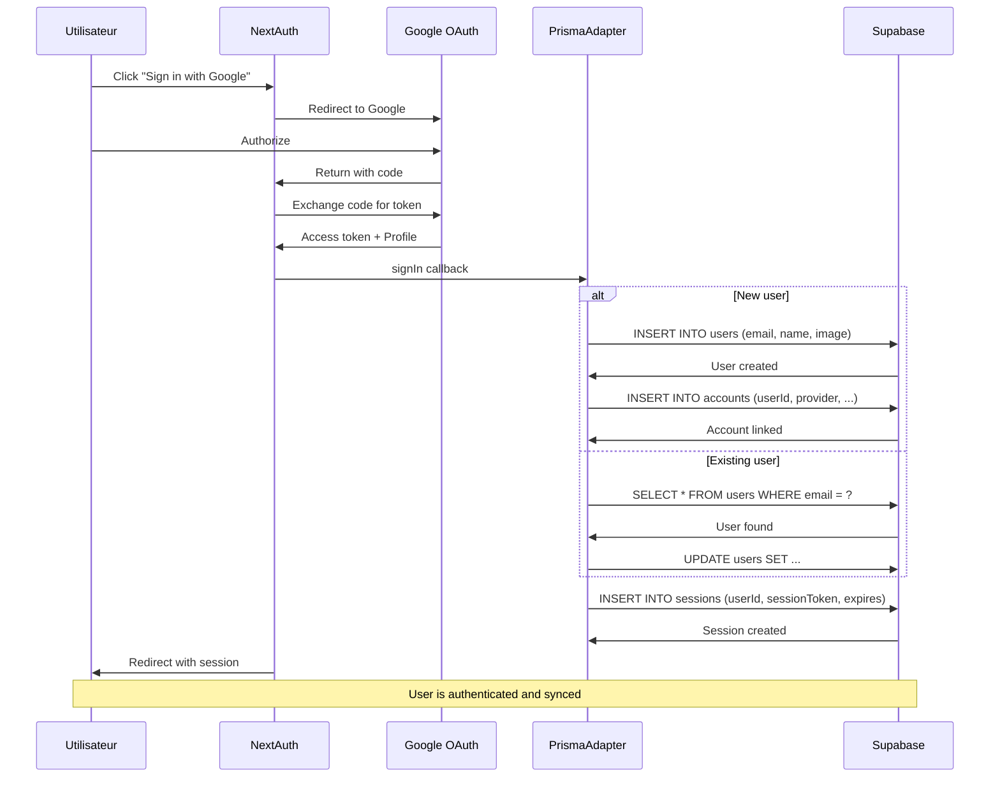

### Flux d'authentification Credentials

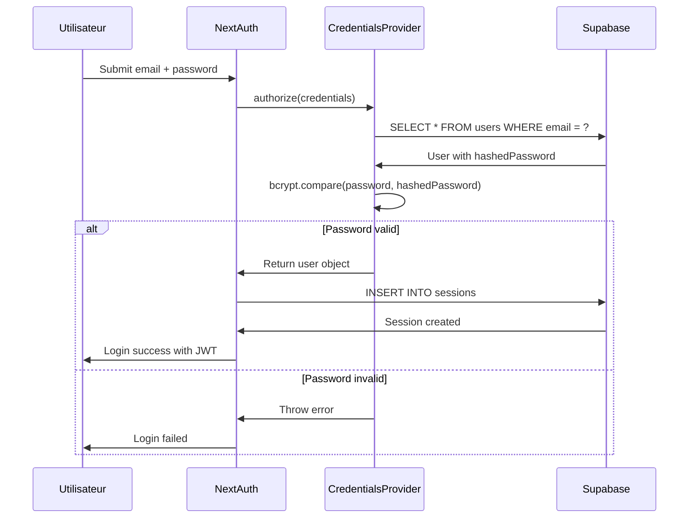

### Schéma de base de données

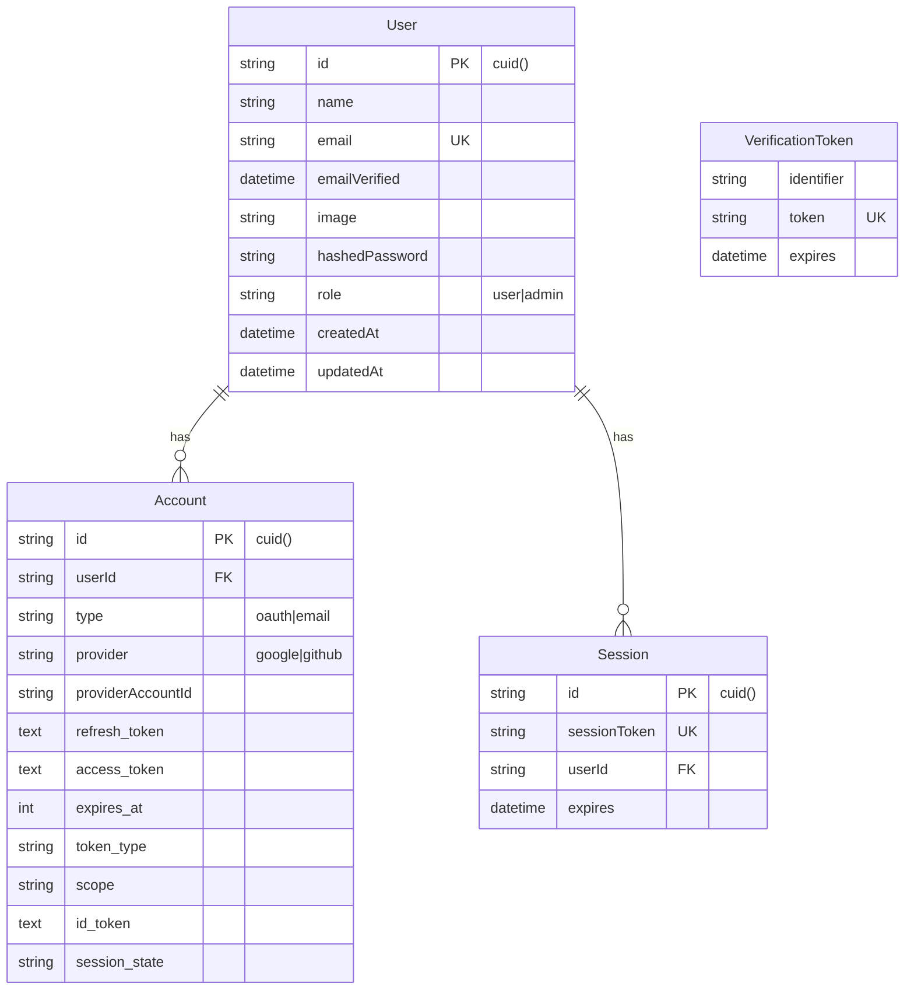

### Flux JWT vs Database Session

```mermaid
graph TB
    subgraph "JWT Strategy (Default)"
        A1[User Login] --> B1[Create JWT]
        B1 --> C1[Sign with SECRET]
        C1 --> D1[Send to Client]
        D1 --> E1[Store in Cookie]
        E1 --> F1[Decode JWT on each request]
    end
    
    subgraph "Database Strategy"
        A2[User Login] --> B2[Create Session in DB]
        B2 --> C2[Generate sessionToken]
        C2 --> D2[Send to Client]
        D2 --> E2[Store in Cookie]
        E2 --> F2[Query DB on each request]
    end
    
    style F1 fill:#a5d6a7
    style F2 fill:#fff59d
```

---

## Demo-4 : NextAuth Relations

### Architecture complète

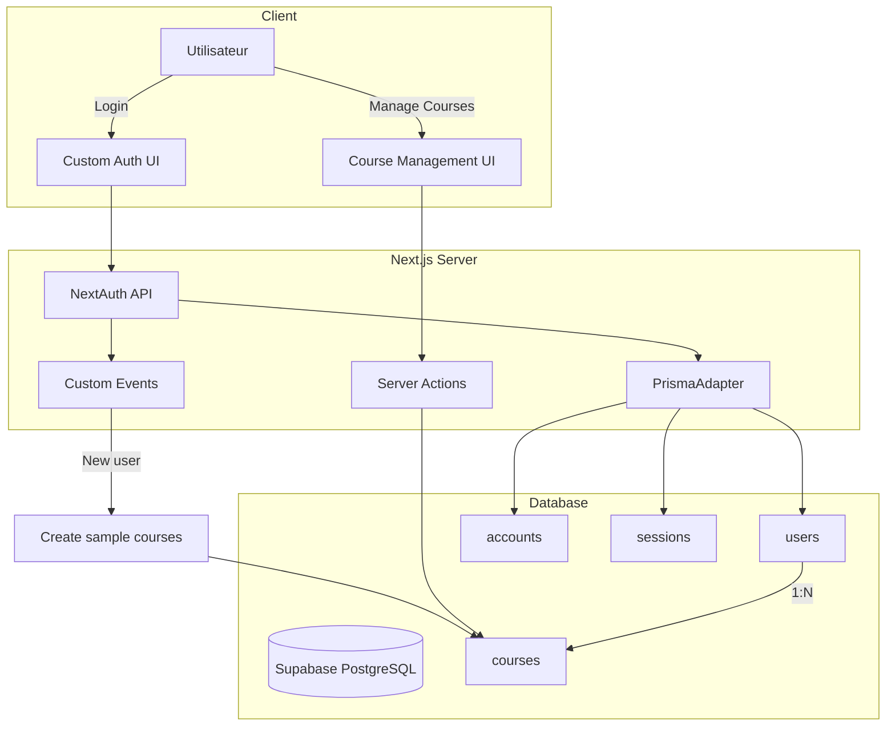

### Flux avec seed automatique

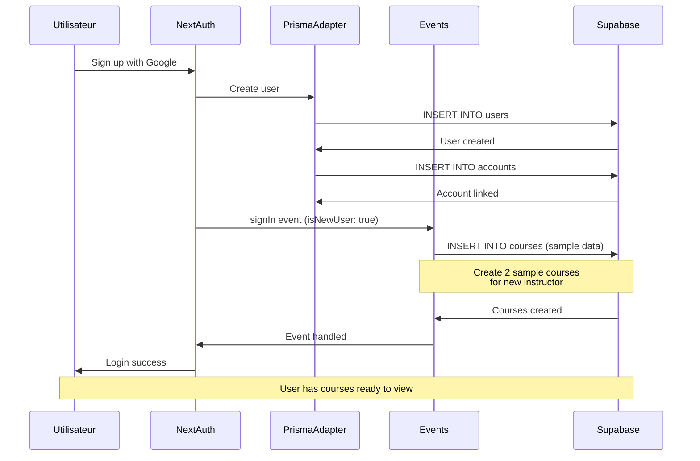

### Flux Server Actions (CRUD)

```mermaid
sequenceDiagram
    participant U as Utilisateur
    participant C as Client Component
    participant SA as Server Action
    participant S as getServerSession
    participant P as Prisma
    participant D as Supabase
    
    U->>C: Click "Create Course"
    C->>SA: createCourse(formData)
    
    SA->>S: Check authentication
    S->>SA: Session with userId
    
    alt Authenticated
        SA->>P: prisma.course.create()
        P->>D: INSERT INTO courses
        D->>P: Course created
        P->>SA: Return course
        SA->>C: revalidatePath + return success
        C->>U: Show success + refresh
    else Not authenticated
        SA->>C: Return error
        C->>U: Show error message
    end
```

### Schéma de base de données

```mermaid
erDiagram
    User ||--o{ Account : has
    User ||--o{ Session : has
    User ||--o{ Course : creates
    
    User {
        string id PK "cuid()"
        string name
        string email UK
        datetime emailVerified
        string image
        string hashedPassword
        string role "user|instructor|admin"
        text bio
        string phoneNumber
        string website
        datetime createdAt
        datetime updatedAt
    }
    
    Account {
        string id PK "cuid()"
        string userId FK
        string type
        string provider
        string providerAccountId
        text refresh_token
        text access_token
        int expires_at
    }
    
    Session {
        string id PK "cuid()"
        string sessionToken UK
        string userId FK
        datetime expires
    }
    
    VerificationToken {
        string identifier
        string token UK
        datetime expires
    }
    
    Course {
        string id PK "cuid()"
        string title
        text description
        string category
        string level
        decimal price
        boolean published
        string imageUrl
        string instructorId FK
        datetime createdAt
        datetime updatedAt
    }
```

### Architecture Server Actions

```mermaid
graph TB
    subgraph "Client Component"
        FORM[Course Form]
        BUTTON[Submit Button]
    end
    
    subgraph "Server Actions"
        CREATE[createCourse]
        UPDATE[updateCourse]
        DELETE[deleteCourse]
        PUBLISH[publishCourse]
    end
    
    subgraph "Authorization"
        CHECK[Check Session]
        VERIFY[Verify Ownership]
    end
    
    subgraph "Database"
        PRISMA[Prisma Client]
        DB[(Supabase)]
    end
    
    FORM --> BUTTON
    BUTTON -->|action| CREATE
    BUTTON -->|action| UPDATE
    BUTTON -->|action| DELETE
    BUTTON -->|action| PUBLISH
    
    CREATE --> CHECK
    UPDATE --> CHECK
    DELETE --> CHECK
    PUBLISH --> CHECK
    
    CHECK --> VERIFY
    VERIFY --> PRISMA
    PRISMA --> DB
```

---

## Comparaisons

### Temps de synchronisation

```mermaid
graph LR
    subgraph "Temps de sync (ms)"
        D0["Demo-0<br/>500-1000ms<br/>(async)"]
        D1["Demo-1<br/>50-200ms<br/>(sync)"]
        D2["Demo-2<br/>100-300ms<br/>(sync)"]
        D3["Demo-3<br/>< 100ms<br/>(auto)"]
        D4["Demo-4<br/>< 200ms<br/>(auto)"]
    end
    
    style D0 fill:#fff9c4
    style D1 fill:#c5e1a5
    style D2 fill:#ffe082
    style D3 fill:#a5d6a7
    style D4 fill:#c5e1a5
```

### Complexité de setup

```mermaid
graph TB
    START[Setup] --> D1{Demo-1<br/>10 min}
    START --> D0{Demo-0<br/>15-20 min}
    START --> D2{Demo-2<br/>10 min}
    START --> D3{Demo-3<br/>20-30 min}
    START --> D4{Demo-4<br/>30-45 min}
    
    D1 --> E1[Simple]
    D0 --> E0[Moyen]
    D2 --> E2[Moyen]
    D3 --> E3[Complexe]
    D4 --> E4[Très Complexe]
    
    style E1 fill:#c8e6c9
    style E0 fill:#fff9c4
    style E2 fill:#fff9c4
    style E3 fill:#ffccbc
    style E4 fill:#ffcdd2
```

### Tables de base de données

```mermaid
graph TB
    subgraph "Nombre de tables"
        T0["Demo-0<br/>1 table"]
        T1["Demo-1<br/>1 table"]
        T2["Demo-2<br/>2 tables"]
        T3["Demo-3<br/>5 tables"]
        T4["Demo-4<br/>6 tables"]
    end
    
    T0 -.-> T1
    T1 -.-> T2
    T2 -.-> T3
    T3 -.-> T4
    
    style T0 fill:#c8e6c9
    style T1 fill:#c8e6c9
    style T2 fill:#ffe0b2
    style T3 fill:#e1bee7
    style T4 fill:#f8bbd0
```

### Coût par nombre d'utilisateurs

```mermaid
graph TD
    subgraph "Clerk (Demo-0,1,2)"
        C1["0-10k users<br/>0 USD/mois"]
        C2["10k-20k users<br/>225 USD/mois"]
        C3["20k-50k users<br/>400 USD/mois"]
        C4["50k-100k users<br/>800 USD/mois"]
    end
    
    subgraph "NextAuth (Demo-3,4)"
        N1["0-∞ users<br/>0 USD/mois"]
    end
    
    C1 --> C2
    C2 --> C3
    C3 --> C4
    
    style C1 fill:#c8e6c9
    style C2 fill:#fff9c4
    style C3 fill:#ffccbc
    style C4 fill:#ffcdd2
    style N1 fill:#a5d6a7
```

### Patterns de synchronisation

```mermaid
graph TB
    subgraph "Webhook Pattern (Demo-0)"
        W1[Event] --> W2[POST]
        W2 --> W3[Verify]
        W3 --> W4[Handle]
        W4 --> W5[DB]
    end
    
    subgraph "Upsert Pattern (Demo-1,2)"
        U1[Request] --> U2[syncUser]
        U2 --> U3[API Call]
        U3 --> U4[Upsert]
        U4 --> U5[DB]
    end
    
    subgraph "Adapter Pattern (Demo-3,4)"
        A1[Auth] --> A2[Adapter]
        A2 --> A3[Auto CRUD]
        A3 --> A4[DB]
    end
    
    style W5 fill:#b3e5fc
    style U5 fill:#e1bee7
    style A4 fill:#ffe0b2
```

---

## Flux de migration

### De Demo-1 vers Demo-0 (Ajouter webhooks)

```mermaid
graph TD
    START[Demo-1 Production] --> STEP1[Install svix]
    STEP1 --> STEP2[Create webhook route]
    STEP2 --> STEP3[Configure Clerk Dashboard]
    STEP3 --> STEP4[Test with ngrok]
    STEP4 --> STEP5[Deploy public endpoint]
    STEP5 --> STEP6[Monitor webhooks]
    STEP6 --> STEP7[Remove syncUser calls]
    STEP7 --> END[Demo-0 Production]
    
    style START fill:#c8e6c9
    style END fill:#b3e5fc
```

### De Clerk vers NextAuth

```mermaid
graph TD
    START[Clerk Project] --> PLAN[Plan Migration]
    PLAN --> BACKUP[Backup Database]
    BACKUP --> INSTALL[Install NextAuth]
    INSTALL --> CONFIG[Configure auth.ts]
    CONFIG --> SCHEMA[Update Prisma Schema]
    SCHEMA --> MIGRATE[Migrate User Data]
    
    MIGRATE --> DUAL[Dual Auth Period]
    DUAL --> COMM[Communicate to Users]
    COMM --> TEST[Test Extensively]
    TEST --> SWITCH[Switch to NextAuth]
    SWITCH --> MONITOR[Monitor]
    MONITOR --> CLEANUP[Remove Clerk]
    CLEANUP --> END[NextAuth Project]
    
    style START fill:#bbdefb
    style DUAL fill:#fff59d
    style END fill:#e1bee7
```

### Progression pédagogique recommandée

```mermaid
graph LR
    START[Débutant] --> D1[Demo-1<br/>Basics]
    D1 --> D2[Demo-2<br/>Relations]
    D2 --> CHOICE{Choix}
    
    CHOICE -->|Clerk Pro| D0[Demo-0<br/>Webhooks]
    CHOICE -->|Open-Source| D3[Demo-3<br/>NextAuth]
    
    D3 --> D4[Demo-4<br/>NextAuth Pro]
    
    style START fill:#c8e6c9
    style D1 fill:#a5d6a7
    style D2 fill:#81c784
    style D0 fill:#66bb6a
    style D3 fill:#66bb6a
    style D4 fill:#4caf50
```

### Migration de schéma : ID séparé vers ID direct

```mermaid
graph TB
    START[Schema Demo-1] --> CHECK{Users Exist?}
    
    CHECK -->|Yes| COMPLEX[Complex Migration]
    CHECK -->|No| SIMPLE[Simple Change]
    
    COMPLEX --> BACKUP[Backup Database]
    BACKUP --> CREATE_NEW[Create users_new table]
    CREATE_NEW --> COPY[Copy data with new ID]
    COPY --> UPDATE_FK[Update foreign keys]
    UPDATE_FK --> RENAME[Rename tables]
    RENAME --> END[Schema Demo-2]
    
    SIMPLE --> MODIFY[Modify Prisma Schema]
    MODIFY --> PUSH[prisma db push]
    PUSH --> END
    
    style COMPLEX fill:#ffccbc
    style SIMPLE fill:#c8e6c9
    style END fill:#a5d6a7
```

---

## Décision Finale

### Arbre de décision complet

```mermaid
graph TB
    START[Nouveau Projet Auth] --> Q1{Quel est votre<br/>niveau?}
    
    Q1 -->|Débutant| D1[Demo-1<br/>Clerk Upsert Basic]
    Q1 -->|Intermédiaire| Q2{Besoin<br/>relations?}
    Q1 -->|Avancé| Q3{Budget?}
    
    Q2 -->|Non| D1
    Q2 -->|Oui| D2[Demo-2<br/>Clerk Relations]
    
    Q3 -->|Disponible| Q4{Temps<br/>réel?}
    Q3 -->|Limité| Q5{Architecture<br/>complexe?}
    
    Q4 -->|Oui| D0[Demo-0<br/>Clerk Webhook]
    Q4 -->|Non| D2
    
    Q5 -->|Non| D3[Demo-3<br/>NextAuth Basic]
    Q5 -->|Oui| D4[Demo-4<br/>NextAuth Relations]
    
    style D0 fill:#bbdefb
    style D1 fill:#c8e6c9
    style D2 fill:#ffe0b2
    style D3 fill:#e1bee7
    style D4 fill:#f8bbd0
```

### Recommandations par contexte

```mermaid
mindmap
  root((Choix<br/>Architecture))
    Contexte Startup
      MVP Rapide
        Demo-1
      Validation Marché
        Demo-1
      Croissance Prévue
        Demo-3 ou Demo-4
    Contexte Entreprise
      Budget IT
        Demo-0
      Contrôle Total
        Demo-4
      Conformité
        Demo-4
    Contexte Apprentissage
      Premier Projet
        Demo-1
      Relations DB
        Demo-2
      Architecture Complète
        Demo-4
    Contexte Open-Source
      Pas de Coût
        Demo-3 ou Demo-4
      Communauté
        Demo-3 ou Demo-4
      Transparence
        Demo-3 ou Demo-4
```

---

## Performance

### Comparaison des temps de réponse

```mermaid
gantt
    title Temps de chargement page (ms)
    dateFormat X
    axisFormat %L
    
    section Demo-0
    Query DB     :0, 150
    
    section Demo-1
    Clerk API    :0, 100
    Upsert       :100, 150
    
    section Demo-2
    Clerk API    :0, 100
    Upsert+Relations :100, 200
    
    section Demo-3
    JWT Decode   :0, 100
    
    section Demo-4
    JWT Decode   :0, 80
    Relations    :80, 120
```

### Opérations de base de données par requête

```mermaid
graph LR
    subgraph "Operations par requête"
        O0["Demo-0<br/>0-1 ops<br/>(Select)"]
        O1["Demo-1<br/>1-2 ops<br/>(Upsert)"]
        O2["Demo-2<br/>2-3 ops<br/>(Upsert+Select)"]
        O3["Demo-3<br/>0-2 ops<br/>(JWT/Session)"]
        O4["Demo-4<br/>1-4 ops<br/>(Relations)"]
    end
    
    style O0 fill:#a5d6a7
    style O1 fill:#fff59d
    style O2 fill:#ffccbc
    style O3 fill:#a5d6a7
    style O4 fill:#ffccbc
```

---

## Sécurité

### Niveaux de sécurité

```mermaid
graph TB
    subgraph "Gestion de la sécurité"
        S0["Demo-0<br/>Clerk + Webhook Verify<br/>Score: 9/10"]
        S1["Demo-1<br/>Clerk<br/>Score: 8/10"]
        S2["Demo-2<br/>Clerk<br/>Score: 8/10"]
        S3["Demo-3<br/>NextAuth DIY<br/>Score: 7/10"]
        S4["Demo-4<br/>NextAuth DIY<br/>Score: 7/10"]
    end
    
    style S0 fill:#a5d6a7
    style S1 fill:#c8e6c9
    style S2 fill:#c8e6c9
    style S3 fill:#fff59d
    style S4 fill:#fff59d
```

### Checklist de sécurité par projet

```mermaid
graph TB
    subgraph "Clerk Projects"
        C1[Variables env sécurisées]
        C2[HTTPS en production]
        C3[IP whitelisting webhook]
        C4[Monitoring Dashboard]
    end
    
    subgraph "NextAuth Projects"
        N1[NEXTAUTH_SECRET fort]
        N2[Bcrypt 12+ rounds]
        N3[Rate limiting]
        N4[Session expiration]
        N5[HTTPS en production]
        N6[Monitoring custom]
    end
    
    style C1 fill:#c8e6c9
    style C2 fill:#c8e6c9
    style C3 fill:#c8e6c9
    style C4 fill:#c8e6c9
    style N1 fill:#ffe082
    style N2 fill:#ffe082
    style N3 fill:#ffe082
    style N4 fill:#ffe082
    style N5 fill:#ffe082
    style N6 fill:#ffe082
```

---

## Résumé Final

### Les 5 projets en un coup d'oeil

```mermaid
mindmap
  root((5 Architectures<br/>Next.js Auth))
    Demo-0
      Clerk Webhook
      Temps réel
      Event-driven
      Production ready
    Demo-1
      Clerk Upsert
      Simple
      MVP rapide
      Débutant friendly
    Demo-2
      Clerk Relations
      Apprentissage
      1:N relations
      LMS exemple
    Demo-3
      NextAuth Basic
      Gratuit
      Contrôle total
      Open-source
    Demo-4
      NextAuth Relations
      Architecture complète
      Production ready
      CRUD complet
```

---

**Document créé le** : 2025-10-23

**Format** : Mermaid diagrams pour visualisation

**Compatibilité** : GitHub, GitLab, VS Code, Notion, Obsidian

