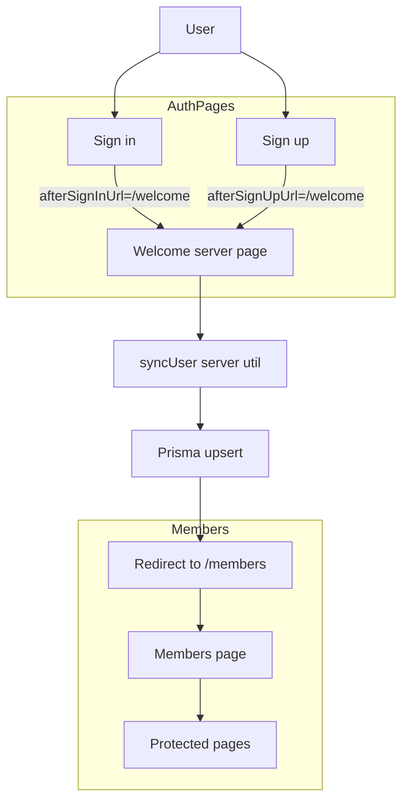
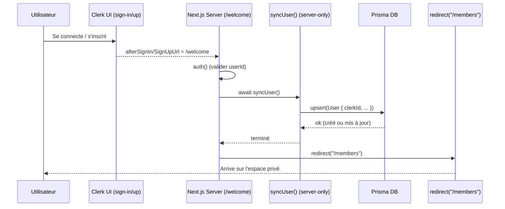

# Clerk + Next.js App Router — Modèle complet « /welcome » (post‑login sync + redirect)

Ce document fournit un exemple **complet, prêt à copier** pour synchroniser l’utilisateur dans votre base (Prisma) **une seule fois après l’authentification**, via une page serveur `/welcome`, puis rediriger vers l’espace membres.

> Cible: Next.js App Router (v14+ ou 15), Clerk, Prisma, TypeScript. Aucune utilisation de webhook.

<br/>


1. [Vue d’ensemble](#1-vue-densemble)
2. [Arborescence cible](#2-arborescence-cible)
3. [Prisma — schéma minimal](#3-prisma--schéma-minimal)
4. [Client Prisma](#4-client-prisma)
5. [Util serveur de synchro (idempotent)](#5-util-serveur-de-synchro-idempotent)
6. [Pages Clerk (auth) → `/welcome`](#6-pages-clerk-auth-avec-redirection-vers-welcome)
7. [Page serveur `/welcome` (sync + redirect)](#7-page-serveur-welcome-sync--redirect)
8. [Page privée d’exemple](#8-page-privée-dexemple)
9. [Middleware — protéger / laisser passer](#9-middleware--protéger-le-reste-laisser-passer-lauth-et-welcome)
10. [Variantes utiles](#10-variantes-utiles)
     10.1 [Server Action](#101--alternative-server-action-si-vous-déclenchez-depuis-un-formulaire)
     10.2 [API Route](#102--api-route-si-vous-préférez-fetch-depuis-un-client)
11. [Débogage & erreurs fréquentes](#11-débogage--erreurs-fréquentes)
12. [Checklist finale](#12-checklist-finale)
13. [Questions fréquentes](#13-questions-fréquentes)
14. [Diagrammes (Flowchart + Séquence)](#diagramme)

**Annexes**

* [Annexe 2 — Composant Serveur : principes et bonnes pratiques](#annexe-2)
* [Annexe 3 — Client Component : usages et limites](#annexe-3)
* [Annexe 4 — La page `/welcome` a-t-elle besoin de UI ?](#annexe-4---la-page-welcome-a-elle-besoin-de-ui)
* [Annexe 5 — Exemple de loader ( `/welcome` )](#annexe-5---exemple-de-loader)
* [Annexe 6 — Questions sur `/welcome` + `AutoSubmit`](#annexe-6)
* [Annexe 7 — Webhooks Clerk : quand et comment](#annexe-7)
* [Annexe 8 — Expliquer `sign-in/[[...rest]]/page.tsx`](#annexe-8)
* [Annexe 9 — Arborescence d’auth : est-ce obligatoire ?](#annexe-9)
* [Annexe 10 — Alternative sans `[[...rest]]` (routing="hash")](#annexe-10---si-tu-veux-éviter-rest)


# 1) Vue d’ensemble

**Principe**

* Les écrans d’auth Clerk redirigent vers `/welcome` via `afterSignInUrl` / `afterSignUpUrl`.
* La page `/welcome` est un **Server Component**: elle appelle `syncUser()` (Prisma `upsert`) puis `redirect("/members")`.
* Le middleware protège les routes privées, mais **laisse passer** `/welcome` et les écrans d’auth.

**Pourquoi c’est robuste**

* `upsert` ⇒ idempotent (créé si absent, mis à jour sinon) ; pas de duplication.
* Aucune logique serveur dans des Client Components ; pas d’erreur `server-only`.
* Exécute la synchro **une fois par session** (à l’arrivée), pas à chaque page.

<br/>


# 2) Arborescence cible

```
app/
  (auth)/
    sign-in/[[...rest]]/page.tsx
    sign-up/[[...rest]]/page.tsx
  welcome/page.tsx
  members/page.tsx
lib/
  prisma.ts
  sync-user.ts
middleware.ts
prisma/
  schema.prisma
.env
```

> Remplace `(auth)` par n’importe quel groupement de routes si besoin.

<br/>

# 3) Prisma — schéma minimal

**`prisma/schema.prisma`**

```prisma
// Datasource & generator usuels…
// datasource db { provider = "postgresql" url = env("DATABASE_URL") }
// generator client { provider = "prisma-client-js" }

model User {
  id              String   @id @default(cuid())
  clerkId         String   @unique
  email           String?  @unique
  name            String?
  imageUrl        String?
  role            Role     @default(USER)
  profileComplete Boolean  @default(false)
  lastLoginAt     DateTime @default(now())
  createdAt       DateTime @default(now())
  updatedAt       DateTime @updatedAt
}

enum Role {
  USER
  ADMIN
}
```

Exécute:

```
npx prisma migrate dev --name init
```

<br/>

# 4) Client Prisma

**`lib/prisma.ts`**

```ts
import { PrismaClient } from "@prisma/client";

export const prisma = new PrismaClient({
  log: process.env.NODE_ENV === "development" ? ["query", "error", "warn"] : ["error"],
});
```

<br/>

# 5) Util serveur de synchro (idempotent)

**`lib/sync-user.ts`**

```ts
import "server-only";
import { auth, currentUser } from "@clerk/nextjs/server";
import { prisma } from "@/lib/prisma";

export async function syncUser() {
  const { userId } = auth();
  if (!userId) return; // garde-fou

  const cu = await currentUser();
  const email = cu?.emailAddresses?.[0]?.emailAddress ?? null;
  const name = [cu?.firstName, cu?.lastName].filter(Boolean).join(" ") || cu?.username || null;
  const imageUrl = cu?.imageUrl ?? null;

  await prisma.user.upsert({
    where: { clerkId: userId },                // champ unique obligatoire
    create: {
      clerkId: userId,
      email,
      name,
      imageUrl,
      role: "USER",
      profileComplete: false,
      lastLoginAt: new Date(),
    },
    update: {
      email,
      name,
      imageUrl,
      lastLoginAt: new Date(),
    },
  });
}
```

> `import "server-only";` empêche d’importer ce fichier depuis un composant client.


<br/>

# 6) Pages Clerk (auth) avec redirection vers `/welcome`

**`app/(auth)/sign-in/[[...rest]]/page.tsx`**

```tsx
import { SignIn } from "@clerk/nextjs";

export default function Page() {
  return <SignIn afterSignInUrl="/welcome" />;
}
```

**`app/(auth)/sign-up/[[...rest]]/page.tsx`**

```tsx
import { SignUp } from "@clerk/nextjs";

export default function Page() {
  return <SignUp afterSignUpUrl="/welcome" />;
}
```

> Si vous avez une route unique `/register`, utilisez `routing="path"` et une route **catch‑all** `app/register/[[...rest]]/page.tsx`, ou bien `routing="hash"`.

<br/>

# 7) Page serveur `/welcome` (sync + redirect)

**`app/welcome/page.tsx`**

```tsx
import { redirect } from "next/navigation";
import { auth } from "@clerk/nextjs/server";
import { syncUser } from "@/lib/sync-user";

export default async function WelcomePage() {
  const { userId } = auth();
  if (!userId) redirect("/sign-in");

  await syncUser();         // exécute la synchro une seule fois post-login
  redirect("/members");    // envoie l’utilisateur dans l’espace privé
}
```

> Pas de `"use client"` ici. C’est un Server Component.

<br/>

# 8) Page privée d’exemple

**`app/members/page.tsx`**

```tsx
export default function MembersPage() {
  return (
    <div className="p-8">
      <h1 className="text-2xl font-semibold">Espace membres</h1>
      <p>Contenu privé…</p>
    </div>
  );
}
```

<br/>

# 9) Middleware — Protéger le reste, laisser passer l’auth et `/welcome`

**`middleware.ts`** (Clerk)

```ts
import { clerkMiddleware, createRouteMatcher } from "@clerk/nextjs/server";

const isPublic = createRouteMatcher([
  "/",                // page d’accueil si publique
  "/welcome",         // DOIT passer
  "/sign-in(.*)",
  "/sign-up(.*)",
  "/register(.*)",    // si vous avez une route register path-based
  "/api/webhooks(.*)", // le cas échéant
]);

export default clerkMiddleware((auth, req) => {
  if (isPublic(req)) return;     // laisser passer ces routes
  auth().protect();              // protéger toutes les autres
});

export const config = {
  matcher: ["/((?!_next|.*\\..*).*)"],
};
```

> Si vous gérez vos propres listes, utilisez `startsWith('/register')` plutôt que `includes`.

<br/>

# 10) Variantes utiles

### 10.1 — Alternative Server Action (si vous déclenchez depuis un formulaire)

```tsx
// app/profile/page.tsx (SERVER)
import { syncUser } from "@/lib/sync-user";

export default function ProfilePage() {
  async function syncAction() {
    "use server";
    await syncUser();
  }

  return (
    <form action={syncAction}>
      <button type="submit" className="btn">Resynchroniser</button>
    </form>
  );
}
```

### 10.2 — API Route (si vous préférez fetch depuis un client)

```ts
// app/api/sync/route.ts (SERVER)
import { NextResponse } from "next/server";
import { syncUser } from "@/lib/sync-user";

export async function POST() {
  await syncUser();
  return NextResponse.json({ ok: true });
}
```


<br/>

# 11) Débogage & erreurs fréquentes

* **Erreur**: `server-only cannot be imported from a Client Component module`
  **Cause**: import serveur (`@clerk/nextjs/server`, `sync-user.ts`) dans un composant client (`"use client"`).
  **Fix**: retire `"use client"` ou sépare en Server Action/API.

* **Erreur**: `Clerk: <SignIn/> or <SignUp/> not configured correctly`
  **Cause**: route non catch‑all avec `routing="path"`, ou middleware qui bloque les sous‑routes.
  **Fix**: utiliser `[[...rest]]` et autoriser `'/sign-in(.*)'`, `'/sign-up(.*)'`, `'/register(.*)'` dans le middleware, ou passer `routing="hash"`.

* **Sync qui tourne trop souvent**
  **Cause**: appel dans `Home` ou pages visitées fréquemment.
  **Fix**: ne synchroniser que sur `/welcome` (post‑login) ou via webhook.


<br/>

# 12) Checklist finale

* [ ] Routes d’auth Clerk en **catch‑all** (ou `routing="hash"`).
* [ ] Page `/welcome` **serveur** qui fait `await syncUser()` puis `redirect()`.
* [ ] Middleware qui **laisse passer** `/welcome` et les routes d’auth.
* [ ] `sync-user.ts` avec `import "server-only"` + Prisma `upsert` basé sur `clerkId` unique.
* [ ] Aucun import serveur dans des **Client Components**.
* [ ] Logs Prisma verbeux uniquement en dev.


<br/>

# 13) Questions fréquentes

**Q: Puis‑je rendre `<SignIn/>` dans une page serveur ?**
R: Oui. Les composants Clerk d’UI sont clients par nature. La page peut rester serveur tant qu’elle ne met pas `"use client"`.

**Q: Où mettre la logique de rôles ?**
R: Source de vérité en base (champ `role`). Côté serveur, vérifiez le rôle avant chaque action sensible.

**Q: L’email doit‑il être unique ?**
R: Optionnel. L’ID Clerk (`clerkId`) doit être unique. L’email peut changer ; gérez le `@unique` selon votre besoin.


<br/>

# Diagramme


```mermaid
flowchart TD
  A[User] --> B[Sign in]
  A --> C[Sign up]

  subgraph AuthPages
    direction TB
    B -->|afterSignInUrl=/welcome| D[Welcome server page]
    C -->|afterSignUpUrl=/welcome| D
  end

  D --> E[syncUser server util]
  E --> F[Prisma upsert]
  F --> G[Redirect to /members]

  subgraph Members
    direction TB
    G --> H[Members page]
    H --> I[Protected pages]
  end


```


```mermaid
sequenceDiagram
  participant U as Utilisateur
  participant UI as Clerk UI (sign-in/up)
  participant S as Next.js Server (/welcome)
  participant SU as syncUser() (server-only)
  participant DB as Prisma DB
  participant R as redirect("/members")

  U->>UI: Se connecte / s'inscrit
  UI-->>S: afterSignIn/SignUpUrl = /welcome
  S->>S: auth() (valider userId)
  S->>SU: await syncUser()
  SU->>DB: upsert(User { clerkId, ... })
  DB-->>SU: ok (créé ou mis à jour)
  SU-->>S: terminé
  S->>R: redirect("/members")
  R-->>U: Arrive sur l'espace privé
```


# annexe 2 


Un **composant serveur** (Next.js App Router) est un composant React **exécuté sur le serveur**, jamais dans le navigateur.

* **Ce que ça fait bien :** il peut accéder en toute sécurité à la **base de données**, aux **secrets** (.env), aux API **server-side** (ex. `@clerk/nextjs/server`, Prisma), faire du **data-fetching** sans exposer les clés, et **rendre du HTML** déjà rempli avant d’arriver au client (meilleures perfs/SEO).
* **Ce qu’il ne peut pas faire :** pas de hooks React client (`useState`, `useEffect`, `useRef` pour l’UI), pas d’événements DOM. S’il te faut de l’interactivité (onClick, formulaires contrôlés…), tu **rend** un **Client Component** à l’intérieur.
* **Reconnaître/écrire :** par défaut, un fichier dans `app/` est serveur **tant que** tu n’écris pas `"use client"` en tête. Un composant client doit explicitement mettre `"use client"`.
* **Communication :** un composant serveur peut **passer des props sérialisables** à un composant client, ou exposer une **Server Action** (fonction marquée `"use server"`) que le client peut appeler via un `<form action={...}>`.
* **Cas d’usage typiques :** pages de **post-login** (`/welcome`), **SSR** avec Prisma, lecture d’auth côté serveur (`auth()`, `currentUser`), rendu de listes/SEO.

Mini-exemple :

```tsx
// app/welcome/page.tsx  → Server Component (pas de "use client")
import { redirect } from "next/navigation";
import { auth } from "@clerk/nextjs/server";
import { prisma } from "@/lib/prisma";

export default async function WelcomePage() {
  const { userId } = auth();
  if (!userId) redirect("/sign-in");

  await prisma.user.upsert({ /* ... */ }); // OK côté serveur
  redirect("/members");
}
```

> Règle d’or : **jamais** importer des APIs serveur (`@clerk/nextjs/server`, Prisma) dans un composant marqué `"use client"`.


# Annexe 3


Un **Client Component** (Next.js App Router) est un composant React exécuté **dans le navigateur**.
Tu le déclares en mettant `"use client"` tout en haut du fichier.

## À quoi ça sert

* Interactivité UI : `onClick`, formulaires contrôlés, animations.
* Hooks **client** : `useState`, `useEffect`, `useRef`, `useContext`.
* Accès aux **APIs client** : `window`, `document`, localStorage, MediaQuery, etc.
* Composants Clerk côté client : `useUser`, `<UserButton/>`, `<SignIn/>`, `<SignUp/>`, `SignedIn/Out`.

## Ce que **tu ne dois pas faire** dans un Client Component

* ❌ **Ne pas** importer des APIs serveur ou du code marqué serveur :

  * `@clerk/nextjs/server` (`auth`, `currentUser`)
  * `import "server-only"`
  * Prisma (accès DB)
  * `fs`, accès .env, secrets
* ❌ **Ne pas** exécuter de logique sensible (RBAC, queries DB) côté client.
* ❌ **Ne pas** mettre de Server Actions directement (les Server Actions vivent dans un composant **serveur** ou une fonction marquée `"use server"` appelée depuis un formulaire).

## Pattern correct (séparer client/serveur)

**Client (UI interactive)**

```tsx
// app/profile/ProfileForm.tsx
"use client";
export function ProfileForm({ action }: { action: (fd: FormData) => Promise<void> }) {
  return (
    <form action={action}>
      <input name="displayName" />
      <button type="submit">Save</button>
    </form>
  );
}
```

**Serveur (logique, DB, auth)**

```tsx
// app/profile/page.tsx  ← SERVER (pas de "use client")
import { ProfileForm } from "./ProfileForm";
import { prisma } from "@/lib/prisma";
import { auth } from "@clerk/nextjs/server";

export default function Page() {
  async function saveAction(fd: FormData) {
    "use server";
    const { userId } = auth();             // OK côté serveur
    await prisma.user.update({
      where: { clerkId: userId! },         // DB OK côté serveur
      data: { name: String(fd.get("displayName") ?? "") },
    });
  }
  return <ProfileForm action={saveAction} />;
}
```

## Règles mémo

* **Client** = interactivité + hooks client. **Serveur** = auth/DB/secrets.
* Un composant **client** peut recevoir des **props sérialisables** depuis un composant serveur, mais **ne peut pas** importer du code serveur.
* Pour appeler du serveur depuis le client :

  * Soit **Server Action** passée comme `action` d’un `<form>`,
  * Soit **route API** (`app/api/.../route.ts`) et `fetch` depuis le client.

## Avec Clerk (pièges courants)

* ✅ Dans **client** : `useUser`, `<UserButton/>`, `<SignIn/>`, `<SignUp/>`.
* ❌ Dans **client** : `auth()`, `currentUser` (serveur only).
* ✅ Synchro DB (`syncUser`, Prisma) → côté **serveur** (ex. page `/welcome`).
* ❌ Ne jamais appeler `syncUser()` dans un composant client ou dans `useEffect`.

> Règle d’or : si ça touche **auth serveur**, **base de données**, **secrets** → c’est **serveur**, pas client.


# Annexe 4 - La page **/welcome** a-elle besoin de UI


Oui, c’est normal : la page **/welcome** n’a pas besoin d’interface graphique. Son job est juste **exécuter la synchro serveur** puis **rediriger**.
Si tu veux **voir** quelque chose (loader/confirmation), voici 2 façons.

---

## Option 1 — Headless (recommandée, sans UI)

Redirige direct après la synchro (ultra rapide) :

```tsx
// app/welcome/page.tsx  (SERVER)
import { redirect } from "next/navigation";
import { auth } from "@clerk/nextjs/server";
import { syncUser } from "@/lib/sync-user";

export default async function WelcomePage() {
  const { userId } = auth();
  if (!userId) redirect("/sign-in");
  await syncUser();
  redirect("/members");
}
```

---

## Option 2 — Avec mini-UI “Synchronisation…” (auto-submit → server action → redirect)

Tu affiches un petit écran, et ça part tout seul.

```tsx
// app/welcome/page.tsx  (SERVER)
import { auth } from "@clerk/nextjs/server";
import { syncUser } from "@/lib/sync-user";

async function syncAndGo() {
  "use server";
  await syncUser();
  // Redirection serveur après synchro
  const { redirect } = await import("next/navigation");
  redirect("/members");
}

export default async function WelcomePage() {
  const { userId } = auth();
  if (!userId) {
    const { redirect } = await import("next/navigation");
    redirect("/sign-in");
  }

  return (
    <div className="min-h-dvh grid place-items-center p-8 text-center">
      <div className="space-y-3">
        <div className="animate-pulse text-xl font-semibold">Synchronisation…</div>
        <p className="text-sm opacity-70">Veuillez patienter une seconde.</p>

        {/* Le formulaire appelle la server action ci-dessus */}
        <form action={syncAndGo} id="auto-sync" />

        {/* Client component qui soumet le formulaire automatiquement */}
        <AutoSubmit formId="auto-sync" />
      </div>
    </div>
  );
}

// app/welcome/AutoSubmit.tsx  (CLIENT)
"use client";
import { useEffect } from "react";

export default function AutoSubmit({ formId }: { formId: string }) {
  useEffect(() => {
    const form = document.getElementById(formId) as HTMLFormElement | null;
    form?.submit();
  }, [formId]);
  return null;
}
```

### Quand choisir quoi ?

* **Option 1** : plus simple et plus rapide → idéal en prod.
* **Option 2** : utile pour avoir un **loader/confirmation** avant la redirection.

> Rappel : toute la logique (Prisma, `auth()`, `syncUser`) reste **côté serveur**. Le composant client sert uniquement à auto-soumettre le formulaire dans l’option 2.


<br/>


# Annexe 5 - exemple de loader

### `src/app/welcome/page.tsx` (SERVER)

```tsx
import { auth } from "@clerk/nextjs/server";
import { redirect } from "next/navigation";
import { syncUser } from "@/lib/sync-user";
import AutoSubmit from "./AutoSubmit";

async function syncAndGo() {
  "use server";
  await syncUser();
  redirect("/members");
}

export default async function WelcomePage() {
  const { userId } = auth();
  if (!userId) redirect("/sign-in");

  return (
    <div className="min-h-dvh grid place-items-center p-8 text-center">
      <div className="space-y-5">
        {/* SPINNER */}
        <div
          aria-label="Synchronisation en cours"
          role="status"
          className="mx-auto h-16 w-16 rounded-full border-4 border-gray-300 border-t-gray-900 animate-spin"
        />
        <div className="text-xl font-semibold">Synchronisation…</div>
        <p className="text-sm opacity-70">Veuillez patienter une seconde.</p>

        {/* Le formulaire déclenche la server action */}
        <form action={syncAndGo} id="auto-sync" />
        <AutoSubmit formId="auto-sync" />
      </div>
    </div>
  );
}
```

### `src/app/welcome/AutoSubmit.tsx` (CLIENT)

```tsx
"use client";
import { useEffect } from "react";

export default function AutoSubmit({ formId }: { formId: string }) {
  useEffect(() => {
    const form = document.getElementById(formId) as HTMLFormElement | null;
    form?.submit();
  }, [formId]);
  return null;
}
```

#### Notes

* Le **spinner** est le div avec `animate-spin` + bord supérieur contrasté (`border-t-gray-900`) — c’est le style “cercle qui tourne” comme tes images.
* Tu peux changer la taille (`h-16 w-16`) ou l’épaisseur (`border-4`) selon le look souhaité.
* Si tu veux une version **foncée** automatique :

  ```html
  className="mx-auto h-16 w-16 rounded-full border-4 border-gray-300 dark:border-gray-700 border-t-gray-900 dark:border-t-white animate-spin"
  ```

##### Option SVG (encore plus lisse)

```tsx
<svg className="mx-auto h-16 w-16 animate-spin" viewBox="0 0 24 24">
  <circle className="opacity-25" cx="12" cy="12" r="10" stroke="currentColor" strokeWidth="4" fill="none"/>
  <path className="opacity-90" fill="currentColor" d="M4 12a8 8 0 018-8v4a4 4 0 00-4 4H4z"/>
</svg>
```


<br/>
<br/>


# Annexe 6

**Question.**
En te basant sur le code de `src/app/welcome/page.tsx` et `src/app/welcome/AutoSubmit.tsx` :

a) Quel est **l’objectif** de la page `/welcome` et **à quel moment** est-elle exécutée ?
b) Pourquoi `WelcomePage` est un **Server Component** tandis que `AutoSubmit` est un **Client Component** ?
c) Décris le **flux complet**: authentification → rendu de `/welcome` → exécution de `syncAndGo` → **redirect**.
d) Quelle est la **raison technique** d’utiliser un `<form action={syncAndGo}>` (server action) plutôt qu’un `fetch` côté client ?
e) Cite **deux améliorations** possibles (ex.: gestion d’erreur, timeout/annulation, message de fallback si l’utilisateur n’est pas connecté).


### `src/app/welcome/page.tsx` (SERVER)

```tsx
import { auth } from "@clerk/nextjs/server";
import { redirect } from "next/navigation";
import { syncUser } from "@/lib/sync-user";
import AutoSubmit from "./AutoSubmit";

async function syncAndGo() {
  "use server";
  await syncUser();
  redirect("/members");
}

export default async function WelcomePage() {
  const { userId } = auth();
  if (!userId) redirect("/sign-in");

  return (
    <div className="min-h-dvh grid place-items-center p-8 text-center">
      <div className="space-y-5">
        {/* SPINNER */}
        <div
          aria-label="Synchronisation en cours"
          role="status"
          className="mx-auto h-16 w-16 rounded-full border-4 border-gray-300 border-t-gray-900 animate-spin"
        />
        <div className="text-xl font-semibold">Synchronisation…</div>
        <p className="text-sm opacity-70">Veuillez patienter une seconde.</p>

        {/* Le formulaire déclenche la server action */}
        <form action={syncAndGo} id="auto-sync" />
        <AutoSubmit formId="auto-sync" />
      </div>
    </div>
  );
}
```

### `src/app/welcome/AutoSubmit.tsx` (CLIENT)

```tsx
"use client";
import { useEffect } from "react";

export default function AutoSubmit({ formId }: { formId: string }) {
  useEffect(() => {
    const form = document.getElementById(formId) as HTMLFormElement | null;
    form?.submit();
  }, [formId]);
  return null;
}
```

#### Notes

* Le **spinner** est le div avec `animate-spin` + bord supérieur contrasté (`border-t-gray-900`) — c’est le style “cercle qui tourne” comme tes images.
* Tu peux changer la taille (`h-16 w-16`) ou l’épaisseur (`border-4`) selon le look souhaité.
* Si tu veux une version **foncée** automatique :

  ```html
  className="mx-auto h-16 w-16 rounded-full border-4 border-gray-300 dark:border-gray-700 border-t-gray-900 dark:border-t-white animate-spin"
  ```

##### Option SVG (encore plus lisse)

```tsx
<svg className="mx-auto h-16 w-16 animate-spin" viewBox="0 0 24 24">
  <circle className="opacity-25" cx="12" cy="12" r="10" stroke="currentColor" strokeWidth="4" fill="none"/>
  <path className="opacity-90" fill="currentColor" d="M4 12a8 8 0 018-8v4a4 4 0 00-4 4H4z"/>
</svg>
```


<br/>
<br/>


# Annexe 7

**Question.**
On utilise Clerk avec Next.js et Prisma. Actuellement, la synchronisation utilisateur se fait via la page serveur **/welcome** (post-login) avec `await syncUser()` puis `redirect()`.
Réponds aux points suivants :

a) Donne **deux raisons** pour lesquelles les **webhooks ne sont pas nécessaires** dans cette approche.
b) Cite **trois situations** où l’usage des **webhooks devient préférable**.
c) Dans le mini-squelette fourni, explique le **rôle de `svix`** et des **en-têtes** (`svix-id`, `svix-timestamp`, `svix-signature`).
d) Justifie l’emploi de **`upsert`** dans les handlers `user.created` / `user.updated`.
e) Que doit-on **autoriser dans le middleware** pour que le webhook fonctionne et pourquoi ?
f) Décris l’action exécutée quand l’événement **`user.deleted`** est reçu et donne un **risque** à considérer en production.


> Courte réponse : 

- **non, les webhooks ne sont pas obligatoires.**

### Quand **ne pas** en utiliser

* Ton besoin = créer/mettre à jour l’utilisateur **une seule fois après login** → la page **`/welcome` (server)** avec `await syncUser()` puis `redirect()` suffit (simple, fiable, idempotent).

### Quand c’est **mieux** d’en utiliser

* Tu veux **re-synchroniser automatiquement** quand le profil change dans Clerk (email, nom, avatar).
* Tu dois réagir à des événements **sans passage par l’UI** (mobile, onglet fermé).
* Tu gères **suppression** d’utilisateur ou logs/analytics sur `session.created`.

### Mini-squelette (si tu en ajoutes plus tard)

```ts
// app/api/webhooks/clerk/route.ts
import { headers } from "next/headers";
import { Webhook } from "svix";
import { prisma } from "@/lib/prisma";

export async function POST(req: Request) {
  const payload = await req.text();
  const wh = new Webhook(process.env.CLERK_WEBHOOK_SECRET!);
  const evt = wh.verify(payload, {
    "svix-id": headers().get("svix-id")!,
    "svix-timestamp": headers().get("svix-timestamp")!,
    "svix-signature": headers().get("svix-signature")!,
  }) as any;

  if (evt.type === "user.created" || evt.type === "user.updated") {
    const u = evt.data;
    await prisma.user.upsert({
      where: { clerkId: u.id },
      create: { clerkId: u.id, email: u.email_addresses?.[0]?.email_address ?? null },
      update: { email: u.email_addresses?.[0]?.email_address ?? null },
    });
  }
  if (evt.type === "user.deleted") {
    await prisma.user.delete({ where: { clerkId: evt.data.id } }).catch(() => {});
  }
  return new Response("ok");
}
```

> Pense à autoriser `/api/webhooks/clerk` dans ton `middleware.ts`.

👉 Pour votre cours : commencez **sans webhook** avec `/welcome`. Ajoutez les webhooks plus tard si vous avez besoin de resync **automatique** des changements de profil.


<br/>

# Annexe 8

## Question - expliquez  sign-in/[[...rest]]/page.tsx

## Réponse :


- `sign-in/[[...rest]]/page.tsx` est une **route “optional catch-all”** de Next.js App Router.

## Pourquoi Clerk en a besoin ?

Avec le **routing “path”** (par défaut), le composant `<SignIn/>` va naviguer sur des **sous-URL** pendant le flow :

* `/sign-in/sso-callback`
* `/sign-in/verify`
* `/sign-in/factor-one`
* etc.

Si ta page est juste `app/sign-in/page.tsx`, ces sous-routes n’existent pas → erreur.
`[[...rest]]` dit à Next : **sers *la même* page pour `/sign-in` ET pour *tous* ses sous-chemins**.

## Syntaxe Next.js

* `[segment]` : segment dynamique (`/user/[id]` → `/user/42`).
* `[...rest]` : **catch-all** obligatoire (doit avoir au moins un segment).
* `[[...rest]]` : **optional catch-all** (match **`/sign-in`** *et* `/sign-in/quelque-chose`).

Clerk recommande `[[...rest]]` pour que **toutes** les étapes du flow passent.

## Exemple minimal (recommandé)

```
src/app/sign-in/[[...rest]]/page.tsx
```

```tsx
import { SignIn } from "@clerk/nextjs";

export default function Page() {
  return <SignIn afterSignInUrl="/welcome" />;
}
```

Même chose pour l’inscription :

```
src/app/sign-up/[[...rest]]/page.tsx
```

```tsx
import { SignUp } from "@clerk/nextjs";

export default function Page() {
  return <SignUp afterSignUpUrl="/welcome" />;
}
```

## Et le middleware ?

Autorise **tout le préfixe** :

```ts
import { clerkMiddleware, createRouteMatcher } from "@clerk/nextjs/server";

const isPublic = createRouteMatcher([
  "/sign-in(.*)",
  "/sign-up(.*)",
  "/welcome",
  "/",
]);

export default clerkMiddleware((auth, req) => {
  if (isPublic(req)) return;
  auth().protect();
});

export const config = { matcher: ["/((?!_next|.*\\..*).*)"] };
```

## Alternative si tu ne veux pas `[[...rest]]`

Passe le composant en **routing hash** :

```tsx
<SignIn routing="hash" />
```

Ici tout se passe sur **une seule URL** (`/sign-in#...`), donc pas besoin de sous-routes.
Mais la plupart des tutos/boilerplates gardent `routing="path"` + `[[...rest]]` (plus propre).

## Résumé en 1 phrase

`sign-in/[[...rest]]/page.tsx` = **une page qui couvre `/sign-in` et toutes ses étapes/variantes**, indispensable quand `<SignIn/>` utilise le routing par chemin (path-based).


<br/>
<br/>


### Questions courtes (réponse libre)

1. Explique en une phrase ce que signifie une route **optional catch-all** `[[...rest]]` dans Next.js.
2. Pourquoi `<SignIn/>` en **routing path** nécessite `sign-in/[[...rest]]/page.tsx` plutôt que `sign-in/page.tsx` ?
3. Donne **deux exemples** d’URL que le flow d’auth peut générer et qui doivent être servies par la même page.
4. Quelle est la différence entre `[...rest]` et `[[...rest]]` ? Donne un cas d’usage pour chacun.
5. Que doit autoriser le **middleware** pour que le flow d’auth fonctionne correctement ? (donne un motif/glob précis)
6. Quelle **alternative** à `[[...rest]]` permet d’éviter les sous-routes tout en gardant `<SignIn/>` ? Quels en sont les impacts UX/URL ?

### QCM (une seule bonne réponse)

7. `[[...rest]]` correspond à :
   A. Un segment dynamique simple
   B. Un **catch-all obligatoire**
   C. Un **catch-all optionnel**
   D. Un alias de `middleware`

8. Avec `<SignIn/>` en routing “path”, la page qui **fonctionne** est :
   A. `app/sign-in/page.tsx`
   B. `app/sign-in/[id]/page.tsx`
   C. `app/sign-in/[...rest]/page.tsx`
   D. `app/sign-in/[[...rest]]/page.tsx`

9. Pour laisser passer toutes les étapes d’auth, le motif **minimal** dans le middleware est :
   A. `"/sign-in"`
   B. `"/sign-in/*"`
   C. `"/sign-in(.*)"`
   D. `"/(sign-in|sign-up)"`

10. L’alternative **sans sous-routes** consiste à :
    A. Mettre `routing="hash"` sur `<SignIn/>`
    B. Remplacer Clerk par NextAuth
    C. Déplacer la page dans `/api`
    D. Activer `edge` runtime


<br/>
<br/>

# Annexe 9

- Est-ce obligatoire de définir l'arboresence d'auth bien que Clerck le fait ?

app/
  (auth)/
    sign-in/[[...rest]]/page.tsx
    sign-up/[[...rest]]/page.tsx
  welcome/page.tsx
  members/page.tsx
  

- Oui, même si **Clerk fournit l’UI**, c’est **toi** qui dois définir **où** cette UI s’affiche.

> Tu as deux options :

## Option A — **Pages embarquées** (recommandé pour un app unifiée)

Tu crées les routes Next.js et tu y **rends** les composants Clerk.

**Arborescence**

```
src/app/
  sign-in/[[...rest]]/page.tsx
  sign-up/[[...rest]]/page.tsx
  welcome/page.tsx
```

**sign-in**

```tsx
// src/app/sign-in/[[...rest]]/page.tsx
import { SignIn } from "@clerk/nextjs";
export default function Page() {
  return <SignIn afterSignInUrl="/welcome" />;
}
```

**sign-up**

```tsx
// src/app/sign-up/[[...rest]]/page.tsx
import { SignUp } from "@clerk/nextjs";
export default function Page() {
  return <SignUp afterSignUpUrl="/welcome" />;
}
```

> `[[...rest]]` = couvre `/sign-in` **et** ses sous-étapes (`/sign-in/verify`, etc.).
> Middleware : autorise `/sign-in(.*)` et `/sign-up(.*)`.

## Option B — **Hosted Pages** (Clerk héberge l’écran d’auth)

Tu n’as **pas** de pages `sign-in`/`sign-up` dans ton app.
Tu rediriges vers les URLs hébergées par Clerk.

**Exemple**

```tsx
// Bouton "Se connecter"
<Link href="https://<your-subdomain>.clerk.accounts.dev/sign-in?redirect_url=https://ton-app.com/welcome">
  Sign in
</Link>
```

Dans ce cas, garde juste `/welcome` (server) pour la sync + redirect après le retour.


# Annexe 10 - si tu veux éviter `[[...rest]]`

### Alternative si tu veux éviter `[[...rest]]`

Garde les pages locales mais force le **routing hash** :

```tsx
<SignIn routing="hash" afterSignInUrl="/welcome" />
<SignUp routing="hash" afterSignUpUrl="/welcome" />
```

(une seule URL, pas de sous-routes → pas besoin de `[[...rest]]`)

---

### À retenir

* **Clerk fournit l’UI**, mais **tu choisis l’intégration** : **embarquée** (Option A) ou **hébergée** (Option B).
* Pour l’embarqué en path-routing : crée `sign-in/[[...rest]]/page.tsx` et `sign-up/[[...rest]]/page.tsx`.
* Après auth : **`/welcome` (server)** → `await syncUser()` → `redirect("/members")`.
* Le **middleware** doit laisser passer `/sign-in(.*)`, `/sign-up(.*)`, `/welcome`.


