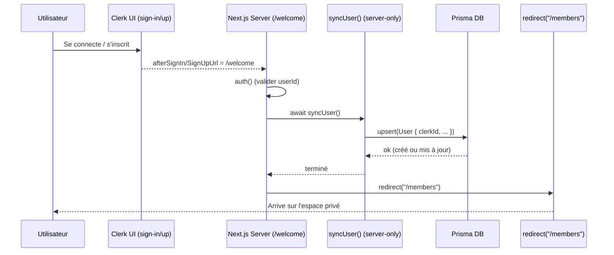

# Clerk + Next.js App Router — Modèle complet « /welcome » (post‑login sync + redirect)

Ce document fournit un exemple **complet, prêt à copier** pour synchroniser l’utilisateur dans votre base (Prisma) **une seule fois après l’authentification**, via une page serveur `/welcome`, puis rediriger vers l’espace membres.

> Cible: Next.js App Router (v14+ ou 15), Clerk, Prisma, TypeScript. Aucune utilisation de webhook.


## 1) Vue d’ensemble

**Principe**

* Les écrans d’auth Clerk redirigent vers `/welcome` via `afterSignInUrl` / `afterSignUpUrl`.
* La page `/welcome` est un **Server Component**: elle appelle `syncUser()` (Prisma `upsert`) puis `redirect("/members")`.
* Le middleware protège les routes privées, mais **laisse passer** `/welcome` et les écrans d’auth.

**Pourquoi c’est robuste**

* `upsert` ⇒ idempotent (créé si absent, mis à jour sinon) ; pas de duplication.
* Aucune logique serveur dans des Client Components ; pas d’erreur `server-only`.
* Exécute la synchro **une fois par session** (à l’arrivée), pas à chaque page.

---

## 2) Arborescence cible

```
app/
  (auth)/
    sign-in/[[...rest]]/page.tsx
    sign-up/[[...rest]]/page.tsx
  welcome/page.tsx
  members/page.tsx
lib/
  prisma.ts
  sync-user.ts
middleware.ts
prisma/
  schema.prisma
.env
```

> Remplace `(auth)` par n’importe quel groupement de routes si besoin.

---

## 3) Prisma — schéma minimal

**`prisma/schema.prisma`**

```prisma
// Datasource & generator usuels…
// datasource db { provider = "postgresql" url = env("DATABASE_URL") }
// generator client { provider = "prisma-client-js" }

model User {
  id              String   @id @default(cuid())
  clerkId         String   @unique
  email           String?  @unique
  name            String?
  imageUrl        String?
  role            Role     @default(USER)
  profileComplete Boolean  @default(false)
  lastLoginAt     DateTime @default(now())
  createdAt       DateTime @default(now())
  updatedAt       DateTime @updatedAt
}

enum Role {
  USER
  ADMIN
}
```

Exécute:

```
npx prisma migrate dev --name init
```

---

## 4) Client Prisma

**`lib/prisma.ts`**

```ts
import { PrismaClient } from "@prisma/client";

export const prisma = new PrismaClient({
  log: process.env.NODE_ENV === "development" ? ["query", "error", "warn"] : ["error"],
});
```

---

## 5) Util serveur de synchro (idempotent)

**`lib/sync-user.ts`**

```ts
import "server-only";
import { auth, currentUser } from "@clerk/nextjs/server";
import { prisma } from "@/lib/prisma";

export async function syncUser() {
  const { userId } = auth();
  if (!userId) return; // garde-fou

  const cu = await currentUser();
  const email = cu?.emailAddresses?.[0]?.emailAddress ?? null;
  const name = [cu?.firstName, cu?.lastName].filter(Boolean).join(" ") || cu?.username || null;
  const imageUrl = cu?.imageUrl ?? null;

  await prisma.user.upsert({
    where: { clerkId: userId },                // champ unique obligatoire
    create: {
      clerkId: userId,
      email,
      name,
      imageUrl,
      role: "USER",
      profileComplete: false,
      lastLoginAt: new Date(),
    },
    update: {
      email,
      name,
      imageUrl,
      lastLoginAt: new Date(),
    },
  });
}
```

> `import "server-only";` empêche d’importer ce fichier depuis un composant client.

---

## 6) Pages Clerk (auth) avec redirection vers `/welcome`

**`app/(auth)/sign-in/[[...rest]]/page.tsx`**

```tsx
import { SignIn } from "@clerk/nextjs";

export default function Page() {
  return <SignIn afterSignInUrl="/welcome" />;
}
```

**`app/(auth)/sign-up/[[...rest]]/page.tsx`**

```tsx
import { SignUp } from "@clerk/nextjs";

export default function Page() {
  return <SignUp afterSignUpUrl="/welcome" />;
}
```

> Si vous avez une route unique `/register`, utilisez `routing="path"` et une route **catch‑all** `app/register/[[...rest]]/page.tsx`, ou bien `routing="hash"`.

---

## 7) Page serveur `/welcome` (sync + redirect)

**`app/welcome/page.tsx`**

```tsx
import { redirect } from "next/navigation";
import { auth } from "@clerk/nextjs/server";
import { syncUser } from "@/lib/sync-user";

export default async function WelcomePage() {
  const { userId } = auth();
  if (!userId) redirect("/sign-in");

  await syncUser();         // exécute la synchro une seule fois post-login
  redirect("/members");    // envoie l’utilisateur dans l’espace privé
}
```

> Pas de `"use client"` ici. C’est un Server Component.

---

## 8) Page privée d’exemple

**`app/members/page.tsx`**

```tsx
export default function MembersPage() {
  return (
    <div className="p-8">
      <h1 className="text-2xl font-semibold">Espace membres</h1>
      <p>Contenu privé…</p>
    </div>
  );
}
```

---

## 9) Middleware — Protéger le reste, laisser passer l’auth et `/welcome`

**`middleware.ts`** (Clerk)

```ts
import { clerkMiddleware, createRouteMatcher } from "@clerk/nextjs/server";

const isPublic = createRouteMatcher([
  "/",                // page d’accueil si publique
  "/welcome",         // DOIT passer
  "/sign-in(.*)",
  "/sign-up(.*)",
  "/register(.*)",    // si vous avez une route register path-based
  "/api/webhooks(.*)", // le cas échéant
]);

export default clerkMiddleware((auth, req) => {
  if (isPublic(req)) return;     // laisser passer ces routes
  auth().protect();              // protéger toutes les autres
});

export const config = {
  matcher: ["/((?!_next|.*\\..*).*)"],
};
```

> Si vous gérez vos propres listes, utilisez `startsWith('/register')` plutôt que `includes`.

---

## 10) Variantes utiles

### 10.1 — Alternative Server Action (si vous déclenchez depuis un formulaire)

```tsx
// app/profile/page.tsx (SERVER)
import { syncUser } from "@/lib/sync-user";

export default function ProfilePage() {
  async function syncAction() {
    "use server";
    await syncUser();
  }

  return (
    <form action={syncAction}>
      <button type="submit" className="btn">Resynchroniser</button>
    </form>
  );
}
```

### 10.2 — API Route (si vous préférez fetch depuis un client)

```ts
// app/api/sync/route.ts (SERVER)
import { NextResponse } from "next/server";
import { syncUser } from "@/lib/sync-user";

export async function POST() {
  await syncUser();
  return NextResponse.json({ ok: true });
}
```

---

## 11) Débogage & erreurs fréquentes

* **Erreur**: `server-only cannot be imported from a Client Component module`
  **Cause**: import serveur (`@clerk/nextjs/server`, `sync-user.ts`) dans un composant client (`"use client"`).
  **Fix**: retire `"use client"` ou sépare en Server Action/API.

* **Erreur**: `Clerk: <SignIn/> or <SignUp/> not configured correctly`
  **Cause**: route non catch‑all avec `routing="path"`, ou middleware qui bloque les sous‑routes.
  **Fix**: utiliser `[[...rest]]` et autoriser `'/sign-in(.*)'`, `'/sign-up(.*)'`, `'/register(.*)'` dans le middleware, ou passer `routing="hash"`.

* **Sync qui tourne trop souvent**
  **Cause**: appel dans `Home` ou pages visitées fréquemment.
  **Fix**: ne synchroniser que sur `/welcome` (post‑login) ou via webhook.

---

## 12) Checklist finale

* [ ] Routes d’auth Clerk en **catch‑all** (ou `routing="hash"`).
* [ ] Page `/welcome` **serveur** qui fait `await syncUser()` puis `redirect()`.
* [ ] Middleware qui **laisse passer** `/welcome` et les routes d’auth.
* [ ] `sync-user.ts` avec `import "server-only"` + Prisma `upsert` basé sur `clerkId` unique.
* [ ] Aucun import serveur dans des **Client Components**.
* [ ] Logs Prisma verbeux uniquement en dev.

---

## 13) Questions fréquentes

**Q: Puis‑je rendre `<SignIn/>` dans une page serveur ?**
R: Oui. Les composants Clerk d’UI sont clients par nature. La page peut rester serveur tant qu’elle ne met pas `"use client"`.

**Q: Où mettre la logique de rôles ?**
R: Source de vérité en base (champ `role`). Côté serveur, vérifiez le rôle avant chaque action sensible.

**Q: L’email doit‑il être unique ?**
R: Optionnel. L’ID Clerk (`clerkId`) doit être unique. L’email peut changer ; gérez le `@unique` selon votre besoin.


# Diagramme

```mermaid
flowchart TD
  A[Utilisateur] --> B[sign-in (Clerk UI)]
  A --> C[sign-up (Clerk UI)]

  subgraph AuthPages [Routes d'auth (catch-all)]
    direction TB
    B -->|afterSignInUrl=/welcome| D[/welcome (Server Component)/]
    C -->|afterSignUpUrl=/welcome| D
  end

  subgraph Middleware [Middleware Clerk]
    direction TB
    M1[Public: "/", "/welcome", "/sign-in(.*)", "/sign-up(.*)", "/register(.*)"]
    M2[Privé: le reste → protect()]
  end

  D --> E[syncUser() — util serveur]
  E --> F[Prisma upsert: where { clerkId } / create/update]
  F --> G[redirect("/members")]

  subgraph Members [Espace privé]
    direction TB
    G --> H[/members]
    H --> I[Pages protégées…]
  end

```




