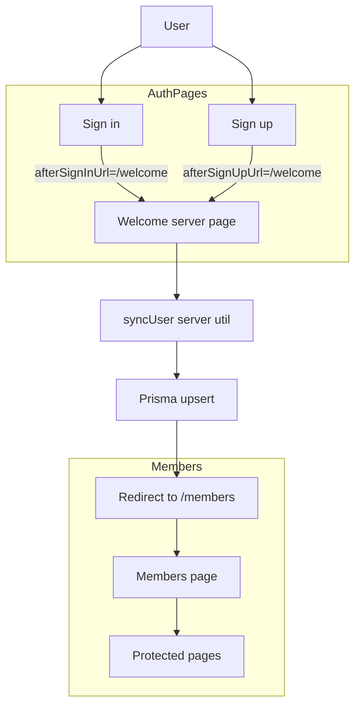
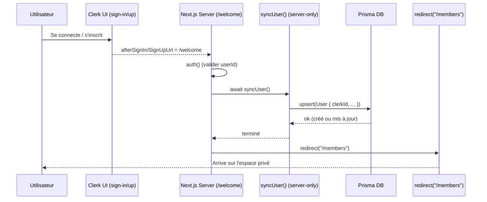

# Clerk + Next.js App Router — Modèle complet « /welcome » (post‑login sync + redirect)

Ce document fournit un exemple **complet, prêt à copier** pour synchroniser l’utilisateur dans votre base (Prisma) **une seule fois après l’authentification**, via une page serveur `/welcome`, puis rediriger vers l’espace membres.

> Cible: Next.js App Router (v14+ ou 15), Clerk, Prisma, TypeScript. Aucune utilisation de webhook.

<br/>


# 1) Vue d’ensemble

**Principe**

* Les écrans d’auth Clerk redirigent vers `/welcome` via `afterSignInUrl` / `afterSignUpUrl`.
* La page `/welcome` est un **Server Component**: elle appelle `syncUser()` (Prisma `upsert`) puis `redirect("/members")`.
* Le middleware protège les routes privées, mais **laisse passer** `/welcome` et les écrans d’auth.

**Pourquoi c’est robuste**

* `upsert` ⇒ idempotent (créé si absent, mis à jour sinon) ; pas de duplication.
* Aucune logique serveur dans des Client Components ; pas d’erreur `server-only`.
* Exécute la synchro **une fois par session** (à l’arrivée), pas à chaque page.

<br/>


# 2) Arborescence cible

```
app/
  (auth)/
    sign-in/[[...rest]]/page.tsx
    sign-up/[[...rest]]/page.tsx
  welcome/page.tsx
  members/page.tsx
lib/
  prisma.ts
  sync-user.ts
middleware.ts
prisma/
  schema.prisma
.env
```

> Remplace `(auth)` par n’importe quel groupement de routes si besoin.

<br/>

# 3) Prisma — schéma minimal

**`prisma/schema.prisma`**

```prisma
// Datasource & generator usuels…
// datasource db { provider = "postgresql" url = env("DATABASE_URL") }
// generator client { provider = "prisma-client-js" }

model User {
  id              String   @id @default(cuid())
  clerkId         String   @unique
  email           String?  @unique
  name            String?
  imageUrl        String?
  role            Role     @default(USER)
  profileComplete Boolean  @default(false)
  lastLoginAt     DateTime @default(now())
  createdAt       DateTime @default(now())
  updatedAt       DateTime @updatedAt
}

enum Role {
  USER
  ADMIN
}
```

Exécute:

```
npx prisma migrate dev --name init
```

<br/>

# 4) Client Prisma

**`lib/prisma.ts`**

```ts
import { PrismaClient } from "@prisma/client";

export const prisma = new PrismaClient({
  log: process.env.NODE_ENV === "development" ? ["query", "error", "warn"] : ["error"],
});
```

<br/>

# 5) Util serveur de synchro (idempotent)

**`lib/sync-user.ts`**

```ts
import "server-only";
import { auth, currentUser } from "@clerk/nextjs/server";
import { prisma } from "@/lib/prisma";

export async function syncUser() {
  const { userId } = auth();
  if (!userId) return; // garde-fou

  const cu = await currentUser();
  const email = cu?.emailAddresses?.[0]?.emailAddress ?? null;
  const name = [cu?.firstName, cu?.lastName].filter(Boolean).join(" ") || cu?.username || null;
  const imageUrl = cu?.imageUrl ?? null;

  await prisma.user.upsert({
    where: { clerkId: userId },                // champ unique obligatoire
    create: {
      clerkId: userId,
      email,
      name,
      imageUrl,
      role: "USER",
      profileComplete: false,
      lastLoginAt: new Date(),
    },
    update: {
      email,
      name,
      imageUrl,
      lastLoginAt: new Date(),
    },
  });
}
```

> `import "server-only";` empêche d’importer ce fichier depuis un composant client.


<br/>

# 6) Pages Clerk (auth) avec redirection vers `/welcome`

**`app/(auth)/sign-in/[[...rest]]/page.tsx`**

```tsx
import { SignIn } from "@clerk/nextjs";

export default function Page() {
  return <SignIn afterSignInUrl="/welcome" />;
}
```

**`app/(auth)/sign-up/[[...rest]]/page.tsx`**

```tsx
import { SignUp } from "@clerk/nextjs";

export default function Page() {
  return <SignUp afterSignUpUrl="/welcome" />;
}
```

> Si vous avez une route unique `/register`, utilisez `routing="path"` et une route **catch‑all** `app/register/[[...rest]]/page.tsx`, ou bien `routing="hash"`.

<br/>

# 7) Page serveur `/welcome` (sync + redirect)

**`app/welcome/page.tsx`**

```tsx
import { redirect } from "next/navigation";
import { auth } from "@clerk/nextjs/server";
import { syncUser } from "@/lib/sync-user";

export default async function WelcomePage() {
  const { userId } = auth();
  if (!userId) redirect("/sign-in");

  await syncUser();         // exécute la synchro une seule fois post-login
  redirect("/members");    // envoie l’utilisateur dans l’espace privé
}
```

> Pas de `"use client"` ici. C’est un Server Component.

<br/>

# 8) Page privée d’exemple

**`app/members/page.tsx`**

```tsx
export default function MembersPage() {
  return (
    <div className="p-8">
      <h1 className="text-2xl font-semibold">Espace membres</h1>
      <p>Contenu privé…</p>
    </div>
  );
}
```

<br/>

# 9) Middleware — Protéger le reste, laisser passer l’auth et `/welcome`

**`middleware.ts`** (Clerk)

```ts
import { clerkMiddleware, createRouteMatcher } from "@clerk/nextjs/server";

const isPublic = createRouteMatcher([
  "/",                // page d’accueil si publique
  "/welcome",         // DOIT passer
  "/sign-in(.*)",
  "/sign-up(.*)",
  "/register(.*)",    // si vous avez une route register path-based
  "/api/webhooks(.*)", // le cas échéant
]);

export default clerkMiddleware((auth, req) => {
  if (isPublic(req)) return;     // laisser passer ces routes
  auth().protect();              // protéger toutes les autres
});

export const config = {
  matcher: ["/((?!_next|.*\\..*).*)"],
};
```

> Si vous gérez vos propres listes, utilisez `startsWith('/register')` plutôt que `includes`.

<br/>

# 10) Variantes utiles

### 10.1 — Alternative Server Action (si vous déclenchez depuis un formulaire)

```tsx
// app/profile/page.tsx (SERVER)
import { syncUser } from "@/lib/sync-user";

export default function ProfilePage() {
  async function syncAction() {
    "use server";
    await syncUser();
  }

  return (
    <form action={syncAction}>
      <button type="submit" className="btn">Resynchroniser</button>
    </form>
  );
}
```

### 10.2 — API Route (si vous préférez fetch depuis un client)

```ts
// app/api/sync/route.ts (SERVER)
import { NextResponse } from "next/server";
import { syncUser } from "@/lib/sync-user";

export async function POST() {
  await syncUser();
  return NextResponse.json({ ok: true });
}
```


<br/>

# 11) Débogage & erreurs fréquentes

* **Erreur**: `server-only cannot be imported from a Client Component module`
  **Cause**: import serveur (`@clerk/nextjs/server`, `sync-user.ts`) dans un composant client (`"use client"`).
  **Fix**: retire `"use client"` ou sépare en Server Action/API.

* **Erreur**: `Clerk: <SignIn/> or <SignUp/> not configured correctly`
  **Cause**: route non catch‑all avec `routing="path"`, ou middleware qui bloque les sous‑routes.
  **Fix**: utiliser `[[...rest]]` et autoriser `'/sign-in(.*)'`, `'/sign-up(.*)'`, `'/register(.*)'` dans le middleware, ou passer `routing="hash"`.

* **Sync qui tourne trop souvent**
  **Cause**: appel dans `Home` ou pages visitées fréquemment.
  **Fix**: ne synchroniser que sur `/welcome` (post‑login) ou via webhook.


<br/>

# 12) Checklist finale

* [ ] Routes d’auth Clerk en **catch‑all** (ou `routing="hash"`).
* [ ] Page `/welcome` **serveur** qui fait `await syncUser()` puis `redirect()`.
* [ ] Middleware qui **laisse passer** `/welcome` et les routes d’auth.
* [ ] `sync-user.ts` avec `import "server-only"` + Prisma `upsert` basé sur `clerkId` unique.
* [ ] Aucun import serveur dans des **Client Components**.
* [ ] Logs Prisma verbeux uniquement en dev.


<br/>

# 13) Questions fréquentes

**Q: Puis‑je rendre `<SignIn/>` dans une page serveur ?**
R: Oui. Les composants Clerk d’UI sont clients par nature. La page peut rester serveur tant qu’elle ne met pas `"use client"`.

**Q: Où mettre la logique de rôles ?**
R: Source de vérité en base (champ `role`). Côté serveur, vérifiez le rôle avant chaque action sensible.

**Q: L’email doit‑il être unique ?**
R: Optionnel. L’ID Clerk (`clerkId`) doit être unique. L’email peut changer ; gérez le `@unique` selon votre besoin.


<br/>

# Diagramme






# annexe 2 


Un **composant serveur** (Next.js App Router) est un composant React **exécuté sur le serveur**, jamais dans le navigateur.

* **Ce que ça fait bien :** il peut accéder en toute sécurité à la **base de données**, aux **secrets** (.env), aux API **server-side** (ex. `@clerk/nextjs/server`, Prisma), faire du **data-fetching** sans exposer les clés, et **rendre du HTML** déjà rempli avant d’arriver au client (meilleures perfs/SEO).
* **Ce qu’il ne peut pas faire :** pas de hooks React client (`useState`, `useEffect`, `useRef` pour l’UI), pas d’événements DOM. S’il te faut de l’interactivité (onClick, formulaires contrôlés…), tu **rend** un **Client Component** à l’intérieur.
* **Reconnaître/écrire :** par défaut, un fichier dans `app/` est serveur **tant que** tu n’écris pas `"use client"` en tête. Un composant client doit explicitement mettre `"use client"`.
* **Communication :** un composant serveur peut **passer des props sérialisables** à un composant client, ou exposer une **Server Action** (fonction marquée `"use server"`) que le client peut appeler via un `<form action={...}>`.
* **Cas d’usage typiques :** pages de **post-login** (`/welcome`), **SSR** avec Prisma, lecture d’auth côté serveur (`auth()`, `currentUser`), rendu de listes/SEO.

Mini-exemple :

```tsx
// app/welcome/page.tsx  → Server Component (pas de "use client")
import { redirect } from "next/navigation";
import { auth } from "@clerk/nextjs/server";
import { prisma } from "@/lib/prisma";

export default async function WelcomePage() {
  const { userId } = auth();
  if (!userId) redirect("/sign-in");

  await prisma.user.upsert({ /* ... */ }); // OK côté serveur
  redirect("/members");
}
```

> Règle d’or : **jamais** importer des APIs serveur (`@clerk/nextjs/server`, Prisma) dans un composant marqué `"use client"`.


# Annexe 3


Un **Client Component** (Next.js App Router) est un composant React exécuté **dans le navigateur**.
Tu le déclares en mettant `"use client"` tout en haut du fichier.

## À quoi ça sert

* Interactivité UI : `onClick`, formulaires contrôlés, animations.
* Hooks **client** : `useState`, `useEffect`, `useRef`, `useContext`.
* Accès aux **APIs client** : `window`, `document`, localStorage, MediaQuery, etc.
* Composants Clerk côté client : `useUser`, `<UserButton/>`, `<SignIn/>`, `<SignUp/>`, `SignedIn/Out`.

## Ce que **tu ne dois pas faire** dans un Client Component

* ❌ **Ne pas** importer des APIs serveur ou du code marqué serveur :

  * `@clerk/nextjs/server` (`auth`, `currentUser`)
  * `import "server-only"`
  * Prisma (accès DB)
  * `fs`, accès .env, secrets
* ❌ **Ne pas** exécuter de logique sensible (RBAC, queries DB) côté client.
* ❌ **Ne pas** mettre de Server Actions directement (les Server Actions vivent dans un composant **serveur** ou une fonction marquée `"use server"` appelée depuis un formulaire).

## Pattern correct (séparer client/serveur)

**Client (UI interactive)**

```tsx
// app/profile/ProfileForm.tsx
"use client";
export function ProfileForm({ action }: { action: (fd: FormData) => Promise<void> }) {
  return (
    <form action={action}>
      <input name="displayName" />
      <button type="submit">Save</button>
    </form>
  );
}
```

**Serveur (logique, DB, auth)**

```tsx
// app/profile/page.tsx  ← SERVER (pas de "use client")
import { ProfileForm } from "./ProfileForm";
import { prisma } from "@/lib/prisma";
import { auth } from "@clerk/nextjs/server";

export default function Page() {
  async function saveAction(fd: FormData) {
    "use server";
    const { userId } = auth();             // OK côté serveur
    await prisma.user.update({
      where: { clerkId: userId! },         // DB OK côté serveur
      data: { name: String(fd.get("displayName") ?? "") },
    });
  }
  return <ProfileForm action={saveAction} />;
}
```

## Règles mémo

* **Client** = interactivité + hooks client. **Serveur** = auth/DB/secrets.
* Un composant **client** peut recevoir des **props sérialisables** depuis un composant serveur, mais **ne peut pas** importer du code serveur.
* Pour appeler du serveur depuis le client :

  * Soit **Server Action** passée comme `action` d’un `<form>`,
  * Soit **route API** (`app/api/.../route.ts`) et `fetch` depuis le client.

## Avec Clerk (pièges courants)

* ✅ Dans **client** : `useUser`, `<UserButton/>`, `<SignIn/>`, `<SignUp/>`.
* ❌ Dans **client** : `auth()`, `currentUser` (serveur only).
* ✅ Synchro DB (`syncUser`, Prisma) → côté **serveur** (ex. page `/welcome`).
* ❌ Ne jamais appeler `syncUser()` dans un composant client ou dans `useEffect`.

> Règle d’or : si ça touche **auth serveur**, **base de données**, **secrets** → c’est **serveur**, pas client.


# Annexe 4 - La page **/welcome** a-elle besoin de UI


Oui, c’est normal : la page **/welcome** n’a pas besoin d’interface graphique. Son job est juste **exécuter la synchro serveur** puis **rediriger**.
Si tu veux **voir** quelque chose (loader/confirmation), voici 2 façons.

---

## Option 1 — Headless (recommandée, sans UI)

Redirige direct après la synchro (ultra rapide) :

```tsx
// app/welcome/page.tsx  (SERVER)
import { redirect } from "next/navigation";
import { auth } from "@clerk/nextjs/server";
import { syncUser } from "@/lib/sync-user";

export default async function WelcomePage() {
  const { userId } = auth();
  if (!userId) redirect("/sign-in");
  await syncUser();
  redirect("/members");
}
```

---

## Option 2 — Avec mini-UI “Synchronisation…” (auto-submit → server action → redirect)

Tu affiches un petit écran, et ça part tout seul.

```tsx
// app/welcome/page.tsx  (SERVER)
import { auth } from "@clerk/nextjs/server";
import { syncUser } from "@/lib/sync-user";

async function syncAndGo() {
  "use server";
  await syncUser();
  // Redirection serveur après synchro
  const { redirect } = await import("next/navigation");
  redirect("/members");
}

export default async function WelcomePage() {
  const { userId } = auth();
  if (!userId) {
    const { redirect } = await import("next/navigation");
    redirect("/sign-in");
  }

  return (
    <div className="min-h-dvh grid place-items-center p-8 text-center">
      <div className="space-y-3">
        <div className="animate-pulse text-xl font-semibold">Synchronisation…</div>
        <p className="text-sm opacity-70">Veuillez patienter une seconde.</p>

        {/* Le formulaire appelle la server action ci-dessus */}
        <form action={syncAndGo} id="auto-sync" />

        {/* Client component qui soumet le formulaire automatiquement */}
        <AutoSubmit formId="auto-sync" />
      </div>
    </div>
  );
}

// app/welcome/AutoSubmit.tsx  (CLIENT)
"use client";
import { useEffect } from "react";

export default function AutoSubmit({ formId }: { formId: string }) {
  useEffect(() => {
    const form = document.getElementById(formId) as HTMLFormElement | null;
    form?.submit();
  }, [formId]);
  return null;
}
```

### Quand choisir quoi ?

* **Option 1** : plus simple et plus rapide → idéal en prod.
* **Option 2** : utile pour avoir un **loader/confirmation** avant la redirection.

> Rappel : toute la logique (Prisma, `auth()`, `syncUser`) reste **côté serveur**. Le composant client sert uniquement à auto-soumettre le formulaire dans l’option 2.


<br/>


# Annexe 5 - exemple de loader

### `src/app/welcome/page.tsx` (SERVER)

```tsx
import { auth } from "@clerk/nextjs/server";
import { redirect } from "next/navigation";
import { syncUser } from "@/lib/sync-user";
import AutoSubmit from "./AutoSubmit";

async function syncAndGo() {
  "use server";
  await syncUser();
  redirect("/members");
}

export default async function WelcomePage() {
  const { userId } = auth();
  if (!userId) redirect("/sign-in");

  return (
    <div className="min-h-dvh grid place-items-center p-8 text-center">
      <div className="space-y-5">
        {/* SPINNER */}
        <div
          aria-label="Synchronisation en cours"
          role="status"
          className="mx-auto h-16 w-16 rounded-full border-4 border-gray-300 border-t-gray-900 animate-spin"
        />
        <div className="text-xl font-semibold">Synchronisation…</div>
        <p className="text-sm opacity-70">Veuillez patienter une seconde.</p>

        {/* Le formulaire déclenche la server action */}
        <form action={syncAndGo} id="auto-sync" />
        <AutoSubmit formId="auto-sync" />
      </div>
    </div>
  );
}
```

### `src/app/welcome/AutoSubmit.tsx` (CLIENT)

```tsx
"use client";
import { useEffect } from "react";

export default function AutoSubmit({ formId }: { formId: string }) {
  useEffect(() => {
    const form = document.getElementById(formId) as HTMLFormElement | null;
    form?.submit();
  }, [formId]);
  return null;
}
```

#### Notes

* Le **spinner** est le div avec `animate-spin` + bord supérieur contrasté (`border-t-gray-900`) — c’est le style “cercle qui tourne” comme tes images.
* Tu peux changer la taille (`h-16 w-16`) ou l’épaisseur (`border-4`) selon le look souhaité.
* Si tu veux une version **foncée** automatique :

  ```html
  className="mx-auto h-16 w-16 rounded-full border-4 border-gray-300 dark:border-gray-700 border-t-gray-900 dark:border-t-white animate-spin"
  ```

##### Option SVG (encore plus lisse)

```tsx
<svg className="mx-auto h-16 w-16 animate-spin" viewBox="0 0 24 24">
  <circle className="opacity-25" cx="12" cy="12" r="10" stroke="currentColor" strokeWidth="4" fill="none"/>
  <path className="opacity-90" fill="currentColor" d="M4 12a8 8 0 018-8v4a4 4 0 00-4 4H4z"/>
</svg>
```

