# Scénario de Démonstration - Demo-1 : clerk-upsert-basic

Guide pratique pour tester et démontrer les migrations Prisma avec évolution progressive du schéma.


## Table des matières

1. [Objectif du scénario](#objectif-du-scénario)
2. [Pré-requis](#pré-requis)
3. [Configuration initiale](#configuration-initiale)
4. [Migration #1 : Initialisation](#migration-1--initialisation)
5. [Migration #2 : Ajouter username](#migration-2--ajouter-username)
6. [Migration #3 : Ajouter rôles](#migration-3--ajouter-rôles)
7. [Migration #4 : Profil et dernière connexion](#migration-4--profil-et-dernière-connexion)
8. [Migration #5 : Optimisation avec index](#migration-5--optimisation-avec-index)
9. [Rollback : Retour en arrière](#rollback--retour-en-arrière)
10. [Vérification et tests](#vérification-et-tests)

---

## Objectif du scénario

Démontrer comment :
- Créer et appliquer des migrations Prisma successives
- Faire évoluer un schéma de base de données progressivement
- Revenir en arrière vers une version antérieure
- Gérer les migrations en développement vs production

---

## Pré-requis

### Variables d'environnement

Créer `.env` avec **connexion directe** Supabase (pas le pooler) :

```env
DATABASE_URL="postgresql://postgres:<PASSWORD>@db.<PROJECT>.supabase.co:5432/postgres?sslmode=require&schema=public"
DIRECT_URL="postgresql://postgres:<PASSWORD>@db.<PROJECT>.supabase.co:5432/postgres?sslmode=require&schema=public"

NEXT_PUBLIC_CLERK_PUBLISHABLE_KEY=pk_test_xxxxx
CLERK_SECRET_KEY=sk_test_xxxxx
```

### Configuration Prisma

Vérifier `prisma/schema.prisma` :

```prisma
generator client {
  provider = "prisma-client-js"
}

datasource db {
  provider  = "postgresql"
  url       = env("DATABASE_URL")
  directUrl = env("DIRECT_URL")
}
```

### Installation

```bash
npm install
```

---

## Configuration initiale

### Étape 1 : Vérifier la connexion

```bash
npx prisma db pull
npx prisma generate
npx prisma studio
```

Si succès, la connexion à Supabase fonctionne.

### Étape 2 : Nettoyer (si nécessaire)

Si des tables existent déjà :

```bash
npx prisma migrate reset --skip-seed
```

---

## Migration #1 : Initialisation

### Objectif

Créer le schéma initial minimaliste avec User.

### Schéma

Modifier `prisma/schema.prisma` :

```prisma
model User {
  id        String   @id @default(cuid())
  clerkId   String   @unique
  email     String   @unique
  createdAt DateTime @default(now())
  updatedAt DateTime @updatedAt

  @@map("users")
}
```

### Commandes

```bash
# Créer la migration
npx prisma migrate dev --name init

# Générer le client Prisma
npx prisma generate
```

### Vérification

```bash
# Vérifier le statut
npx prisma migrate status

# Ouvrir Prisma Studio
npx prisma studio
```

**Résultat attendu** :
- Table `users` créée avec 5 colonnes
- Migration `init` appliquée

### Diagramme

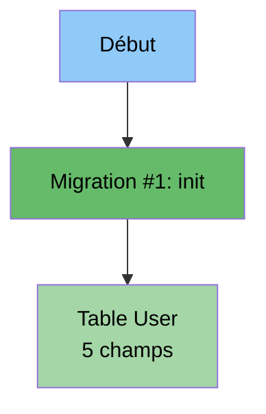

---

## Migration #2 : Ajouter username

### Objectif

Ajouter un champ `username` unique et obligatoire.

### Modification du schéma

```prisma
model User {
  id        String   @id @default(cuid())
  clerkId   String   @unique
  email     String   @unique
  username  String   @unique   // ← NOUVEAU
  createdAt DateTime @default(now())
  updatedAt DateTime @updatedAt

  @@map("users")
}
```

### Commandes

```bash
npx prisma migrate dev --name add_username_to_user
npx prisma generate
```

### Vérification

```bash
npx prisma migrate status
npx prisma studio
```

**Résultat attendu** :
- Colonne `username` ajoutée
- Contrainte UNIQUE sur username
- 2 migrations appliquées

### Diagramme

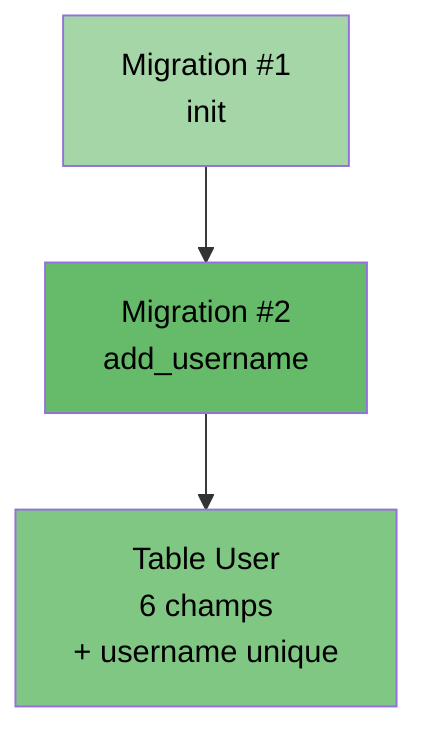

---

## Migration #3 : Ajouter rôles

### Objectif

Créer un enum `Role` et ajouter le champ `role` avec valeur par défaut.

### Modification du schéma

```prisma
enum Role {
  USER
  ADMIN
}

model User {
  id        String   @id @default(cuid())
  clerkId   String   @unique
  email     String   @unique
  username  String   @unique
  role      Role     @default(USER)  // ← NOUVEAU
  createdAt DateTime @default(now())
  updatedAt DateTime @updatedAt

  @@map("users")
}
```

### Commandes

```bash
npx prisma migrate dev --name add_role_enum_and_field
npx prisma generate
```

### Vérification

Dans Prisma Studio, vérifier :
- Type ENUM `Role` créé
- Champ `role` avec valeur par défaut `USER`

### Diagramme

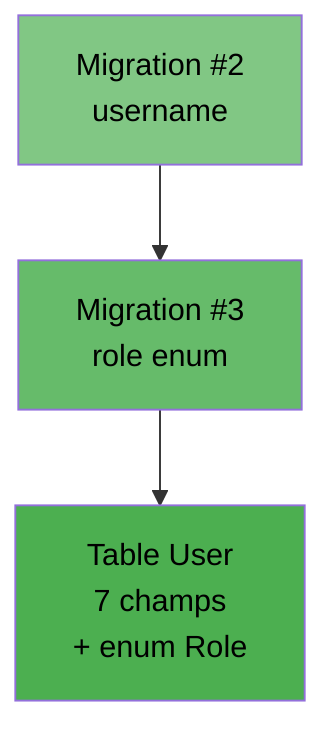

---

## Migration #4 : Profil et dernière connexion

### Objectif

Ajouter des champs pour gérer l'état du profil et tracker la dernière connexion.

### Modification du schéma

```prisma
enum Role {
  USER
  ADMIN
}

model User {
  id              String   @id @default(cuid())
  clerkId         String   @unique
  email           String   @unique
  username        String   @unique
  role            Role     @default(USER)
  profileComplete Boolean  @default(false)     // ← NOUVEAU
  lastLogin       DateTime?                    // ← NOUVEAU
  createdAt       DateTime @default(now())
  updatedAt       DateTime @updatedAt

  @@map("users")
}
```

### Commandes

```bash
npx prisma migrate dev --name add_profile_complete_and_last_login
npx prisma generate
```

### Vérification

```bash
npx prisma migrate status
```

**Résultat attendu** :
```
Status: 4 migrations applied
1. init
2. add_username_to_user
3. add_role_enum_and_field
4. add_profile_complete_and_last_login
```

### Diagramme

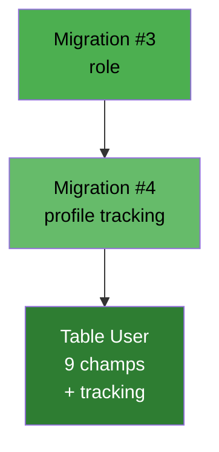

---

## Migration #5 : Optimisation avec index

### Objectif

Améliorer les performances avec un index composite sur les colonnes fréquemment requêtées.

### Modification du schéma

```prisma
model User {
  id              String   @id @default(cuid())
  clerkId         String   @unique
  email           String   @unique
  username        String   @unique
  role            Role     @default(USER)
  profileComplete Boolean  @default(false)
  lastLogin       DateTime?
  createdAt       DateTime @default(now())
  updatedAt       DateTime @updatedAt

  @@map("users")
  @@index([role, profileComplete])  // ← NOUVEAU INDEX
}
```

### Commandes

```bash
npx prisma migrate dev --name add_index_role_profileComplete
npx prisma generate
```

### Vérification

```bash
# Voir toutes les migrations
npx prisma migrate status

# Vérifier l'index dans la DB
npx prisma studio
```

### Évolution complète

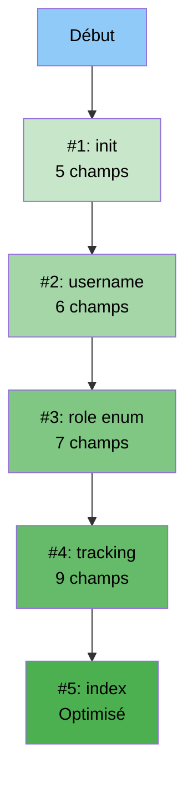

---

## Rollback : Retour en arrière

### Deux stratégies selon l'environnement

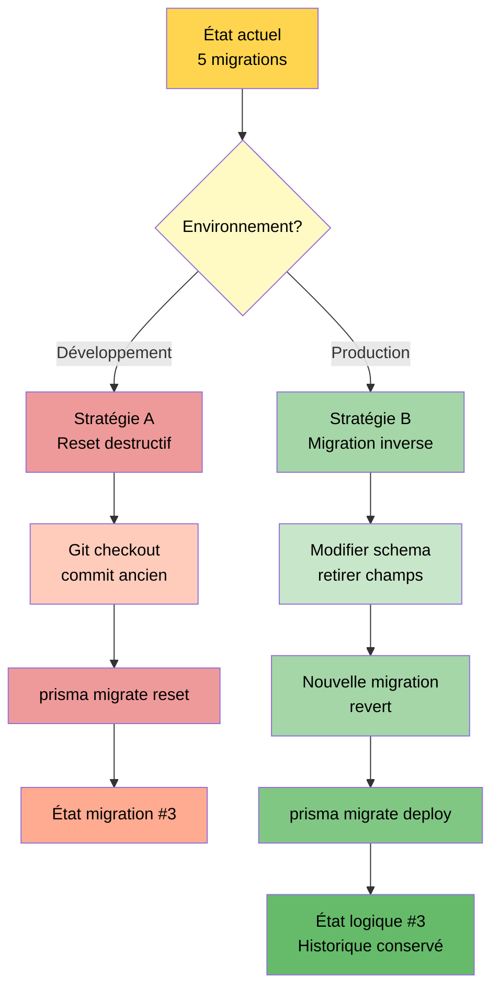

### A) Développement : Reset destructif

**Étape 1** : Revenir au commit Git de la migration #3

```bash
git log --oneline
git checkout <commit-hash-migration-3>
```

**Étape 2** : Reset et réappliquer

```bash
npx prisma migrate reset --skip-seed
npx prisma generate
```

**Étape 3** : Vérifier

```bash
npx prisma migrate status
# Devrait montrer seulement 3 migrations
```

**Attention** : Toutes les données sont perdues avec `reset` !

### B) Production : Migration inverse (non destructif)

**Étape 1** : Modifier le schéma pour retirer les champs

Retirer de `schema.prisma` :
- `@@index([role, profileComplete])`
- `profileComplete Boolean @default(false)`
- `lastLogin DateTime?`

**Étape 2** : Créer la migration inverse

```bash
npx prisma migrate dev --name revert_to_migration_3_shape
npx prisma generate
```

**Étape 3** : Déployer en production

```bash
npx prisma migrate deploy
npx prisma generate
```

**Avantage** : L'historique complet est conservé (traçabilité).

---

## Vérification et tests

### Commandes utiles

#### Voir l'état des migrations

```bash
npx prisma migrate status
```

#### Inspecter une migration spécifique

```bash
cat prisma/migrations/20251023170100_add_username_to_user/migration.sql
```

#### Comparer schéma actuel vs migrations

```bash
npx prisma migrate diff \
  --from-migrations prisma/migrations \
  --to-schema-datamodel prisma/schema.prisma \
  --script
```

#### Marquer une migration comme rolled back (avancé)

```bash
npx prisma migrate resolve --rolled-back 20251023172300_add_profile_complete_and_last_login
```

Note : À utiliser uniquement si vous avez déjà remis la base manuellement dans l'état attendu.

### Tester avec Prisma Studio

```bash
npx prisma studio
```

Ouvrir http://localhost:5555 et :
1. Créer quelques utilisateurs
2. Vérifier les contraintes (unique, default)
3. Tester les valeurs d'enum
4. Observer les relations (après migrations avec relations)

---

## Scénario complet de démonstration

### Étape par étape (30 minutes)

#### Partie 1 : Évolution progressive (20 minutes)

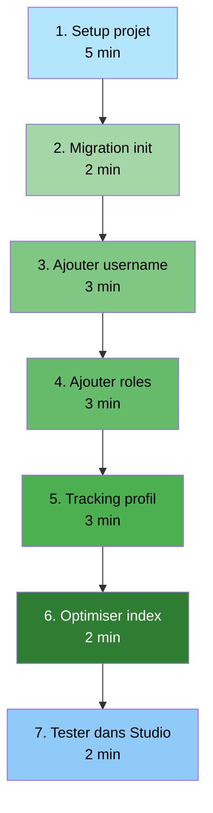

**1. Setup projet (5 min)**
```bash
cd 01-demo-1-clerk-upsert-basic
npm install
cp ../env.sample .env
# Éditer .env avec vos clés
```

**2. Migration init (2 min)**
```bash
# Appliquer le schéma initial
npx prisma migrate dev --name init
npx prisma generate
npx prisma studio  # Vérifier la table créée
```

**3. Ajouter username (3 min)**
```bash
# Modifier schema.prisma (ajouter username)
npx prisma migrate dev --name add_username_to_user
npx prisma generate
# Dans Studio : créer un user, vérifier que username est requis
```

**4. Ajouter roles (3 min)**
```bash
# Modifier schema.prisma (ajouter enum Role + champ role)
npx prisma migrate dev --name add_role_enum_and_field
npx prisma generate
# Dans Studio : vérifier que role = USER par défaut
```

**5. Tracking profil (3 min)**
```bash
# Modifier schema.prisma (ajouter profileComplete, lastLogin)
npx prisma migrate dev --name add_profile_complete_and_last_login
npx prisma generate
# Dans Studio : vérifier profileComplete = false, lastLogin = null
```

**6. Optimiser index (2 min)**
```bash
# Modifier schema.prisma (ajouter @@index)
npx prisma migrate dev --name add_index_role_profileComplete
npx prisma generate
```

**7. Tester dans Studio (2 min)**
- Créer 5 utilisateurs avec différents rôles
- Tester les contraintes unique
- Vérifier les valeurs par défaut

#### Partie 2 : Rollback (10 minutes)

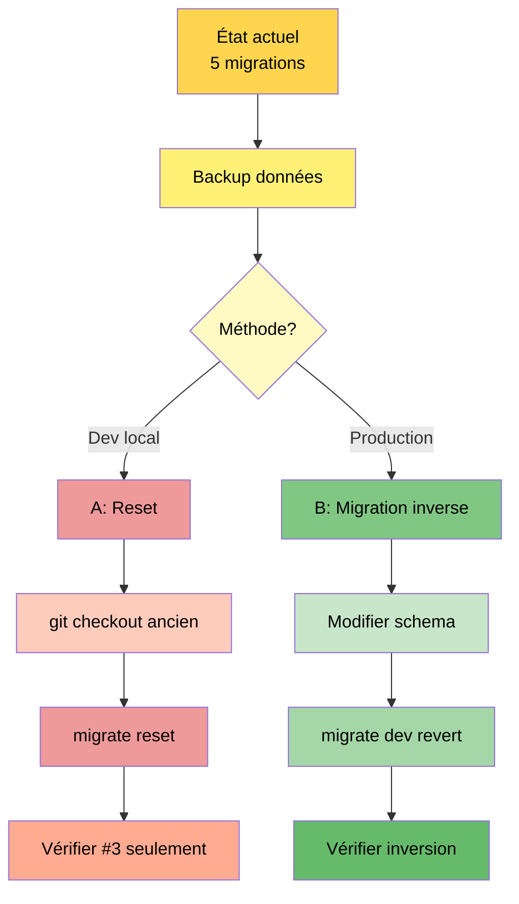

**Méthode A - Reset (développement)**
```bash
# 1. Revenir à un commit antérieur
git log --oneline
git checkout <commit-migration-3>

# 2. Reset complet
npx prisma migrate reset --skip-seed

# 3. Générer
npx prisma generate

# 4. Vérifier
npx prisma migrate status
```

**Méthode B - Migration inverse (production)**
```bash
# 1. Modifier schema.prisma : retirer
#    - @@index([role, profileComplete])
#    - profileComplete Boolean @default(false)
#    - lastLogin DateTime?

# 2. Créer migration inverse
npx prisma migrate dev --name revert_to_migration_3_shape

# 3. Générer
npx prisma generate

# 4. Vérifier
npx prisma migrate status
# Vous aurez maintenant 6 migrations (3 forward + 1 revert)
```

---

## Cas d'usage réels

### Scénario 1 : Développement d'une nouvelle feature

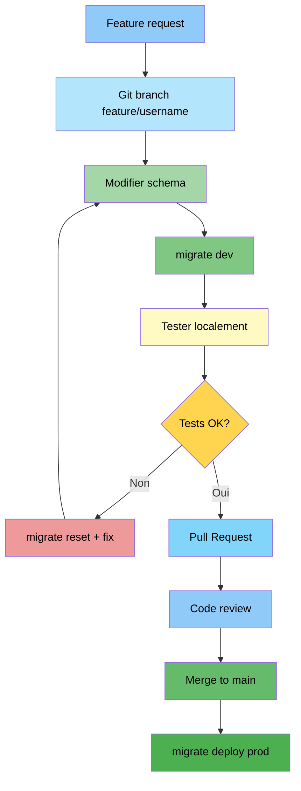

### Scénario 2 : Hotfix en production

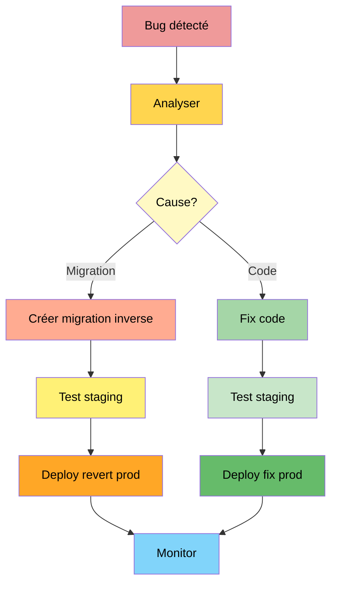

---

## Checklist de démonstration

### Avant de commencer

- [ ] Supabase projet créé
- [ ] Clés Clerk obtenues
- [ ] `.env` configuré
- [ ] `npm install` exécuté
- [ ] Connexion DB testée

### Migration progressive

- [ ] Migration #1 (init) appliquée et vérifiée
- [ ] Migration #2 (username) appliquée et testée
- [ ] Migration #3 (role) appliquée et vérifiée
- [ ] Migration #4 (tracking) appliquée et testée
- [ ] Migration #5 (index) appliquée et vérifiée
- [ ] Toutes les migrations visibles dans `migrate status`

### Tests fonctionnels

- [ ] Créer un user dans Prisma Studio
- [ ] Vérifier contraintes unique (email, username, clerkId)
- [ ] Vérifier valeurs par défaut (role=USER, profileComplete=false)
- [ ] Tester l'application avec Clerk (signup/login)
- [ ] Vérifier sync avec syncUser()

### Rollback

- [ ] Backup des données créé
- [ ] Méthode choisie (A ou B)
- [ ] Rollback exécuté avec succès
- [ ] État vérifié avec `migrate status`
- [ ] Données vérifiées dans Studio

---

## Problèmes courants et solutions

### Erreur : "Migration already applied"

**Cause** : Migration déjà présente dans la table `_prisma_migrations`

**Solution** :
```bash
# Voir les migrations en DB
npx prisma migrate status

# Résoudre manuellement
npx prisma migrate resolve --applied <migration-name>
```

### Erreur : "Unique constraint violation"

**Cause** : Données existantes violent la contrainte unique

**Solution** :
```bash
# Nettoyer les doublons avant migration
# Ou utiliser migrate reset en dev
npx prisma migrate reset
```

### Erreur : "Direct URL required"

**Cause** : DIRECT_URL manquant dans .env

**Solution** :
```env
DIRECT_URL="postgresql://..."
```

### Migration bloquée

**Cause** : Transaction en cours ou lock

**Solution** :
```bash
# Relancer
npx prisma migrate dev

# Ou forcer (attention !)
npx prisma migrate deploy --force
```

---

## Commandes de référence rapide

### Créer une migration

```bash
npx prisma migrate dev --name <nom_descriptif>
```

### Appliquer en production

```bash
npx prisma migrate deploy
```

### Voir l'état

```bash
npx prisma migrate status
```

### Reset (dev uniquement)

```bash
npx prisma migrate reset
```

### Générer le client

```bash
npx prisma generate
```

### Ouvrir l'interface

```bash
npx prisma studio
```

### Comparer états

```bash
npx prisma migrate diff \
  --from-migrations prisma/migrations \
  --to-schema-datamodel prisma/schema.prisma \
  --script
```

---

## Résumé du scénario

### Évolution du schéma

| Migration | Champs totaux | Nouveauté | Temps |
|-----------|---------------|-----------|-------|
| #1 init | 5 | Table User initiale | 2 min |
| #2 username | 6 | + username unique | 2 min |
| #3 role | 7 | + enum Role + role | 3 min |
| #4 tracking | 9 | + profileComplete + lastLogin | 3 min |
| #5 index | 9 | + index composite | 2 min |

**Total** : 12 minutes pour 5 migrations

### Points clés démontrés

1. Évolution progressive d'un schéma
2. Ajout de contraintes (unique, default)
3. Utilisation d'enums
4. Optimisation avec index
5. Rollback en développement
6. Rollback en production (non destructif)

---

## Diagramme récapitulatif complet

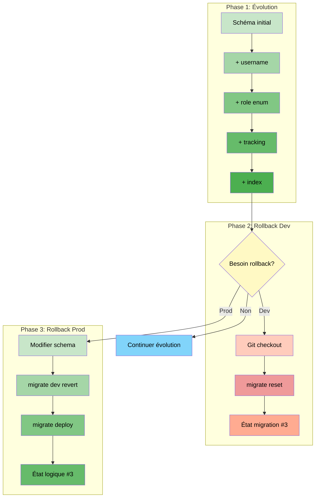

---

## Conclusion

Ce scénario démontre :

- **Évolution maîtrisée** : 5 migrations successives
- **Flexibilité** : Rollback possible (dev et prod)
- **Traçabilité** : Historique complet des changements
- **Sécurité** : Stratégies différentes selon environnement

**Temps total** : 30-40 minutes pour le scénario complet

**Prochaines étapes** :
- Intégrer avec l'application Clerk
- Tester syncUser() avec nouveau schéma
- Déployer en production

---

**Document créé le** : 2025-10-23

**Version** : 1.0

**Projet** : Demo-1 clerk-upsert-basic

