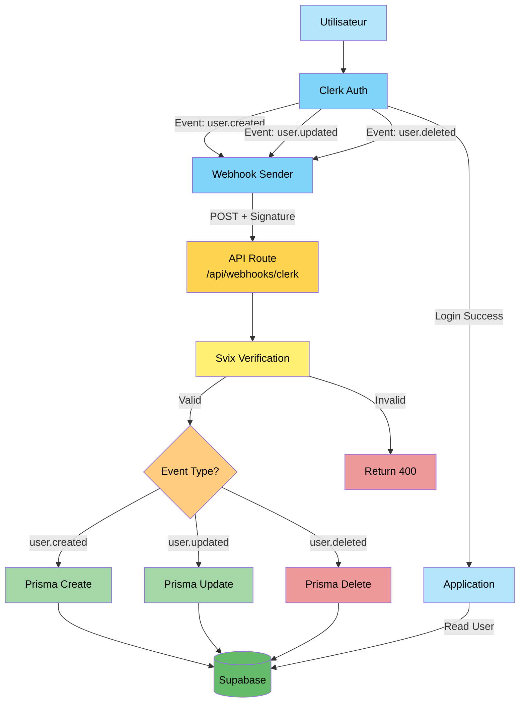
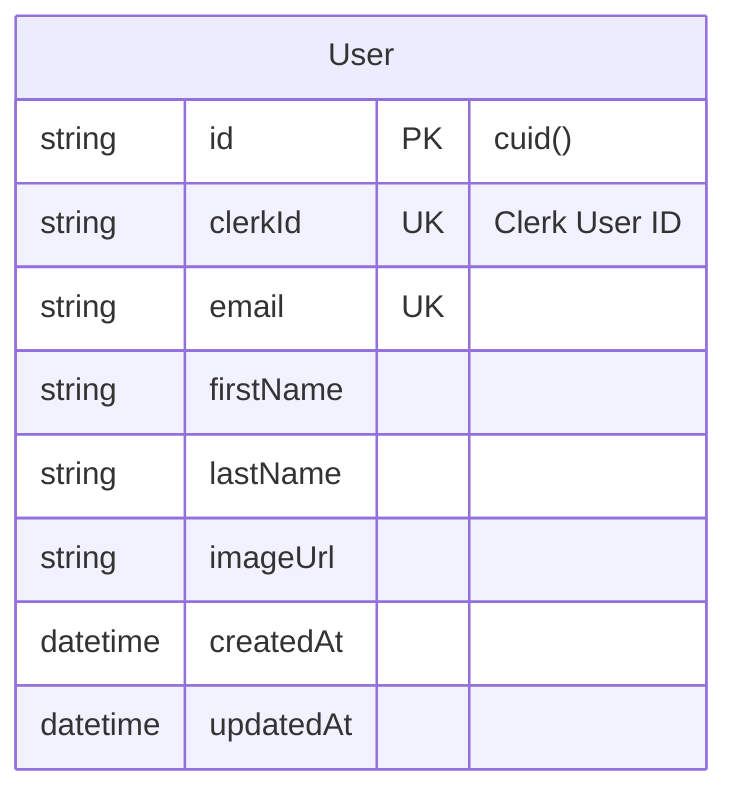
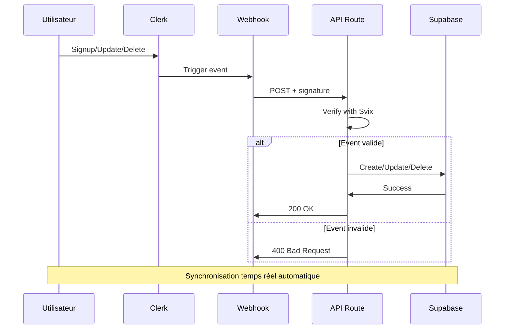

# Demo-0 : clerk-webhook-sync

#### Description

Architecture professionnelle utilisant Clerk avec synchronisation automatique via webhooks. Aucun code de synchronisation manuel requis dans l'application.

#### Schéma de base de données

```prisma
model User {
  id        String   @id @default(cuid())
  clerkId   String   @unique
  email     String   @unique
  firstName String?
  lastName  String?
  imageUrl  String?
  createdAt DateTime @default(now())
  updatedAt DateTime @updatedAt
}
```

#### Architecture de synchronisation

```
User Action → Clerk → Webhook Event → API Route → Prisma → Supabase
```

#### Code clé

Route webhook (`app/api/webhooks/clerk/route.ts`) :

```typescript
export async function POST(req: Request) {
  const WEBHOOK_SECRET = process.env.CLERK_WEBHOOK_SECRET
  
  // Vérifier signature avec Svix
  const wh = new Webhook(WEBHOOK_SECRET)
  const evt = wh.verify(payload, headers)
  
  switch (evt.type) {
    case 'user.created':
      await prisma.user.create({ data: { ... } })
      break
    case 'user.updated':
      await prisma.user.update({ where: { clerkId }, data: { ... } })
      break
    case 'user.deleted':
      await prisma.user.delete({ where: { clerkId } })
      break
  }
  
  return Response.json({ success: true })
}
```

#### Variables d'environnement requises

```
NEXT_PUBLIC_CLERK_PUBLISHABLE_KEY
CLERK_SECRET_KEY
CLERK_WEBHOOK_SECRET
DATABASE_URL
```

#### Dépendances spécifiques

- `@clerk/nextjs` : 4.29.0
- `svix` : 1.15.0

#### Avantages techniques

1. Synchronisation en temps réel (< 1 seconde)
2. Aucun code de sync dans l'application
3. Architecture découplée et event-driven
4. Gère automatiquement création, mise à jour et suppression
5. Fiabilité garantie par Clerk (retry automatique)
6. Production-ready

#### Inconvénients techniques

1. Configuration initiale plus complexe
2. Nécessite exposition publique de l'endpoint (ngrok en développement)
3. Debugging moins direct
4. Dépendance externe pour la synchronisation
5. Coût Clerk après 10,000 utilisateurs actifs/mois

#### Cas d'usage optimaux

- Applications en production nécessitant une synchronisation temps réel
- Architectures microservices event-driven
- Applications avec besoins de traçabilité complète
- Projets nécessitant réaction immédiate aux événements utilisateur

#### Métriques

- Temps de setup : 15-20 minutes
- Temps de synchronisation : 500ms - 1s (async)
- Charge serveur : Faible (événementiel)
- Maintenance : Faible

---

## Annexe : Diagramme d'architecture

### Architecture complète Demo-0



### Schéma de base de données



### Flux événementiel



