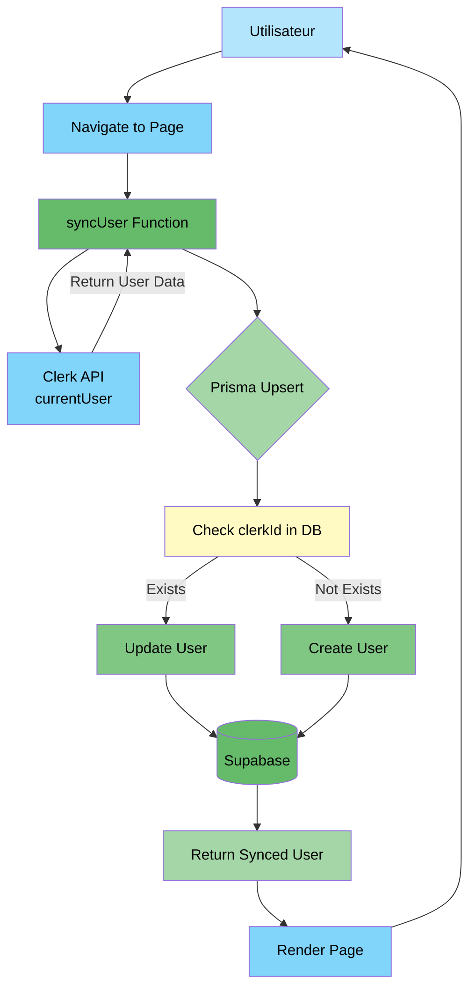
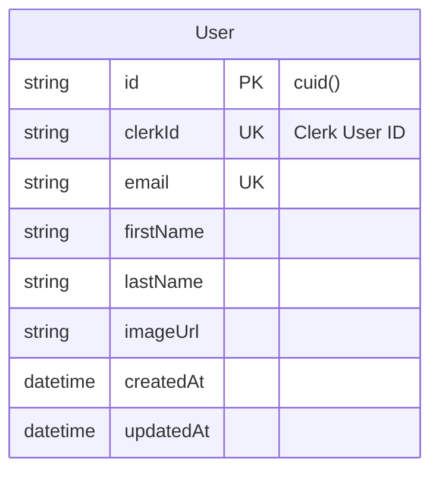
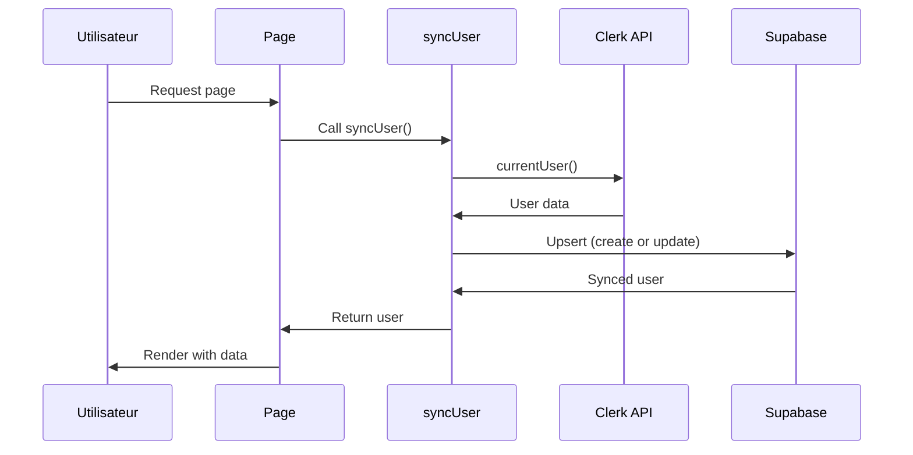

# Demo-1 : clerk-upsert-basic

#### Description

Architecture simple et directe utilisant Clerk avec synchronisation manuelle via opération upsert Prisma. Approche traditionnelle idéale pour l'apprentissage.

#### Schéma de base de données

```prisma
model User {
  id        String   @id @default(cuid())
  clerkId   String   @unique
  email     String   @unique
  firstName String?
  lastName  String?
  imageUrl  String?
  createdAt DateTime @default(now())
  updatedAt DateTime @updatedAt
}
```

#### Architecture de synchronisation

```
Page Load → syncUser() → currentUser() Clerk → Prisma Upsert → Supabase
```

#### Code clé

Fonction de synchronisation (`lib/sync-user.ts`) :

```typescript
export async function syncUser() {
  const clerkUser = await currentUser()
  if (!clerkUser) return null

  const email = clerkUser.emailAddresses[0]?.emailAddress
  
  const user = await prisma.user.upsert({
    where: { clerkId: clerkUser.id },
    update: { email, firstName, lastName, imageUrl },
    create: { clerkId, email, firstName, lastName, imageUrl }
  })
  
  return user
}
```

Utilisation dans les pages :

```typescript
export default async function Page() {
  const user = await syncUser()
  // Utiliser user
}
```

#### Variables d'environnement requises

```
NEXT_PUBLIC_CLERK_PUBLISHABLE_KEY
CLERK_SECRET_KEY
DATABASE_URL
```

#### Dépendances spécifiques

- `@clerk/nextjs` : 5.0.0

#### Avantages techniques

1. Simplicité maximale (45 lignes de code)
2. Contrôle total sur le moment de synchronisation
3. Fonctionne sans configuration externe
4. Debugging simple et direct
5. Pas de dépendance à des services tiers additionnels
6. Fonctionne en environnement localhost standard

#### Inconvénients techniques

1. Code répétitif (appel syncUser() requis dans chaque route)
2. Synchronisation uniquement lors des visites utilisateur
3. Latence ajoutée à chaque chargement de page (50-200ms)
4. Pas de synchronisation des suppressions utilisateur
5. Données peuvent être temporairement désynchronisées
6. Opération de base de données à chaque requête

#### Cas d'usage optimaux

- MVPs et prototypes rapides
- Projets d'apprentissage Next.js et Prisma
- Applications sans besoin de synchronisation temps réel
- Équipes débutantes en développement web
- Projets avec budget limité initialement
- Environnements de développement sans infrastructure complexe

#### Métriques

- Temps de setup : 5-10 minutes
- Temps de synchronisation : 50-200ms par page
- Charge serveur : Moyenne (à chaque page)
- Maintenance : Faible

---

## Annexe : Diagramme d'architecture

### Architecture complète Demo-1



### Schéma de base de données



### Flux de synchronisation

