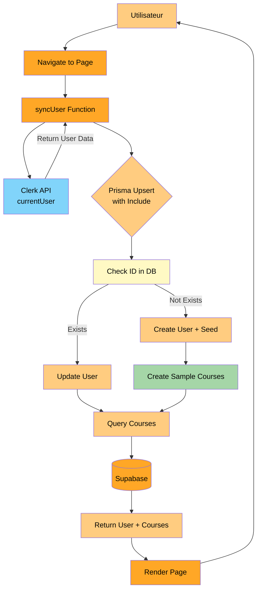
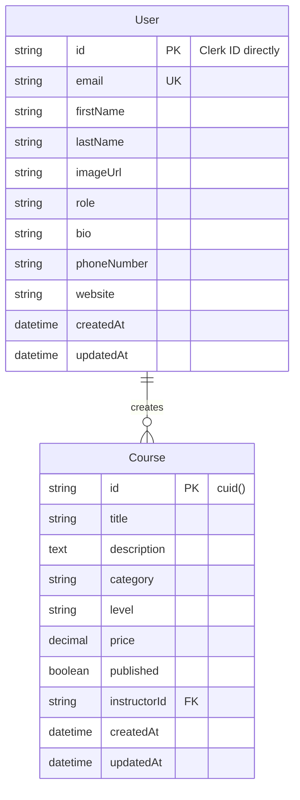
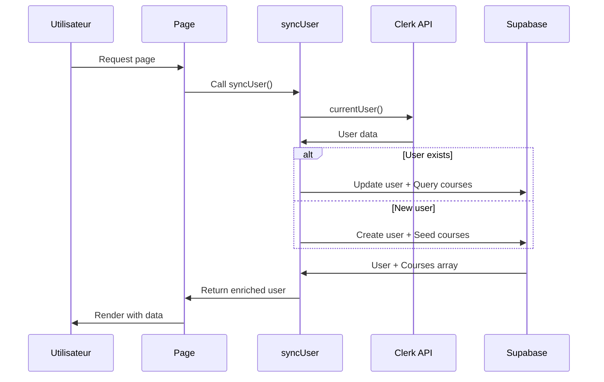

# Demo-2 : clerk-upsert-relations

#### Description

Extension du projet clerk-upsert-basic démontrant l'utilisation de relations Prisma. Utilise l'approche ID direct (clerkId comme clé primaire) et gestion d'entités liées.

#### Schéma de base de données

```prisma
model User {
  id          String   @id
  email       String   @unique
  firstName   String?
  lastName    String?
  imageUrl    String?
  role        String   @default("user")
  bio         String?
  phoneNumber String?
  website     String?
  createdAt   DateTime @default(now())
  updatedAt   DateTime @updatedAt
  courses     Course[] @relation("InstructorCourses")
}

model Course {
  id           String   @id @default(cuid())
  title        String
  description  String?  @db.Text
  category     String
  level        String   @default("beginner")
  price        Decimal  @default(0) @db.Decimal(10, 2)
  published    Boolean  @default(false)
  instructorId String
  instructor   User     @relation("InstructorCourses", fields: [instructorId], references: [id], onDelete: Cascade)
  createdAt    DateTime @default(now())
  updatedAt    DateTime @updatedAt
  
  @@index([instructorId])
  @@index([category])
  @@index([published])
}
```

#### Architecture de synchronisation

```
Page Load → syncUser() → Upsert User + Include Courses → Seed Courses (if new) → Return enriched User
```

#### Code clé

Fonction de synchronisation avec relations :

```typescript
export async function syncUser() {
  const clerkUser = await currentUser()
  if (!clerkUser) return null

  const user = await prisma.user.upsert({
    where: { id: clerkUser.id },
    update: { email, firstName, lastName, imageUrl },
    create: { 
      id: clerkUser.id,
      email, firstName, lastName, imageUrl, role: 'user'
    },
    include: {
      courses: {
        orderBy: { createdAt: 'desc' },
        take: 10
      }
    }
  })
  
  return user
}
```

#### Variables d'environnement requises

```
NEXT_PUBLIC_CLERK_PUBLISHABLE_KEY
CLERK_SECRET_KEY
DATABASE_URL
```

#### Dépendances spécifiques

- `@clerk/nextjs` : 5.0.0

#### Avantages techniques

1. Schéma simplifié (un seul identifiant)
2. Pas de jointure nécessaire pour lier User et Clerk
3. Excellent exemple de relations Prisma One-to-Many
4. Attributs utilisateur enrichis (role, bio, phone, website)
5. Cascade delete automatique (User → Courses)
6. Index optimisés pour performance
7. Seed automatique de données d'exemple

#### Inconvénients techniques

1. Migration difficile si changement de provider d'authentification
2. ID non auto-généré (doit être fourni manuellement)
3. Même limitations de synchronisation que Demo-1
4. Complexité accrue avec gestion des relations
5. Opérations de base de données plus lourdes (includes)

#### Cas d'usage optimaux

- Apprentissage des relations Prisma
- Plateformes d'apprentissage (LMS)
- Marketplaces avec vendeurs
- Applications nécessitant profils utilisateurs enrichis
- Projets avec gestion de rôles
- Démos et prototypes avec données réalistes

#### Métriques

- Temps de setup : 10 minutes
- Temps de synchronisation : 100-300ms par page
- Charge serveur : Moyenne-Élevée (relations)
- Maintenance : Moyenne

---

## Annexe : Diagramme d'architecture

### Architecture complète Demo-2



### Schéma de base de données avec relations



### Flux avec relations

