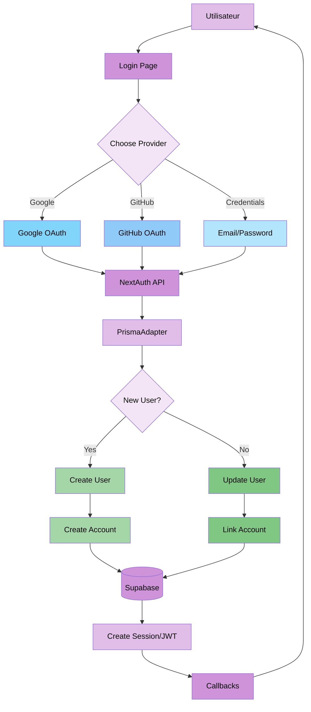
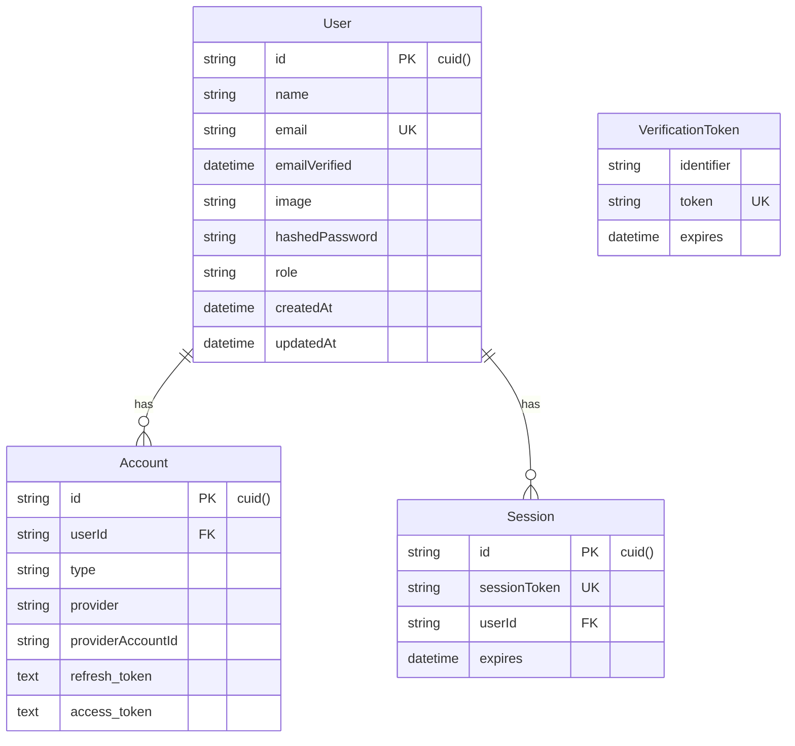
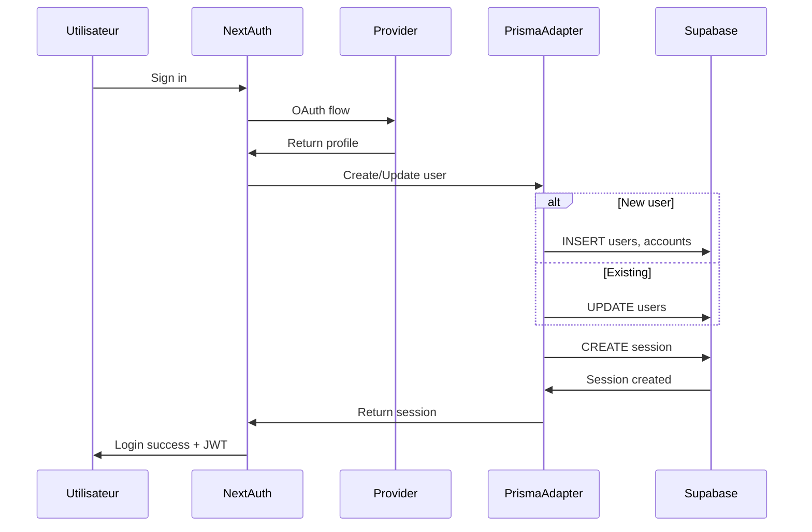

# Demo-3 : nextauth-basic

#### Description

Architecture open-source utilisant NextAuth.js avec synchronisation automatique via PrismaAdapter. Alternative gratuite et entièrement contrôlable à Clerk.

#### Schéma de base de données

```prisma
model Account {
  id                String  @id @default(cuid())
  userId            String
  type              String
  provider          String
  providerAccountId String
  refresh_token     String? @db.Text
  access_token      String? @db.Text
  expires_at        Int?
  token_type        String?
  scope             String?
  id_token          String? @db.Text
  session_state     String?
  user              User    @relation(fields: [userId], references: [id], onDelete: Cascade)
  
  @@unique([provider, providerAccountId])
}

model Session {
  id           String   @id @default(cuid())
  sessionToken String   @unique
  userId       String
  expires      DateTime
  user         User     @relation(fields: [userId], references: [id], onDelete: Cascade)
}

model User {
  id             String    @id @default(cuid())
  name           String?
  email          String?   @unique
  emailVerified  DateTime?
  image          String?
  hashedPassword String?
  role           String    @default("user")
  accounts       Account[]
  sessions       Session[]
  createdAt      DateTime  @default(now())
  updatedAt      DateTime  @updatedAt
}

model VerificationToken {
  identifier String
  token      String   @unique
  expires    DateTime
  
  @@unique([identifier, token])
}
```

#### Architecture de synchronisation

```
User Login → NextAuth Providers → PrismaAdapter → Auto Create/Update (User, Account, Session) → JWT/Database Session
```

#### Code clé

Configuration NextAuth (`lib/auth.ts`) :

```typescript
export const authOptions: NextAuthOptions = {
  adapter: PrismaAdapter(prisma),
  session: { strategy: "jwt", maxAge: 30 * 24 * 60 * 60 },
  providers: [
    GoogleProvider({ ... }),
    GitHubProvider({ ... }),
    CredentialsProvider({ ... })
  ],
  callbacks: {
    async jwt({ token, user }) {
      if (user) {
        token.id = user.id
        token.role = user.role
      }
      return token
    },
    async session({ session, token }) {
      session.user.id = token.id
      session.user.role = token.role
      return session
    }
  }
}
```

#### Variables d'environnement requises

```
NEXTAUTH_URL
NEXTAUTH_SECRET
DATABASE_URL
GOOGLE_CLIENT_ID (optionnel)
GOOGLE_CLIENT_SECRET (optionnel)
GITHUB_ID (optionnel)
GITHUB_SECRET (optionnel)
```

#### Dépendances spécifiques

- `next-auth` : 4.24.5
- `@next-auth/prisma-adapter` : 1.0.7
- `bcryptjs` : 2.4.3

#### Avantages techniques

1. Coût zéro (illimité, pas de limite d'utilisateurs)
2. Contrôle total sur l'authentification
3. Open-source (pas de vendor lock-in)
4. Support de 40+ providers OAuth
5. Synchronisation automatique via adapter
6. Personnalisation illimitée
7. Sessions en base de données (révocation immédiate possible)
8. Callbacks et events personnalisables
9. Support natif de stratégies JWT et Database
10. Communauté active et documentation exhaustive

#### Inconvénients techniques

1. Configuration plus complexe (140 lignes de configuration)
2. UI d'authentification à créer soi-même
3. Plus de responsabilités (sécurité, hashing, validation)
4. 4 tables obligatoires (schéma imposé par NextAuth)
5. Courbe d'apprentissage plus élevée
6. Configuration OAuth requise pour chaque provider
7. Gestion manuelle du hashing de mots de passe
8. Pas de composants UI fournis

#### Cas d'usage optimaux

- Projets à long terme avec prévision de scalabilité importante
- Applications open-source
- Projets avec budget très limité
- Besoin de contrôle total sur l'authentification
- Applications nécessitant personnalisation poussée
- Projets prévoyant plus de 10,000 utilisateurs
- SaaS avec forte croissance prévue
- Applications nécessitant conformité stricte (RGPD, etc.)

#### Métriques

- Temps de setup : 20-30 minutes
- Temps de synchronisation : Auto (< 100ms)
- Charge serveur : Faible (JWT)
- Maintenance : Moyenne

---

## Annexe : Diagramme d'architecture

### Architecture complète Demo-3



### Schéma de base de données NextAuth



### Flux d'authentification


